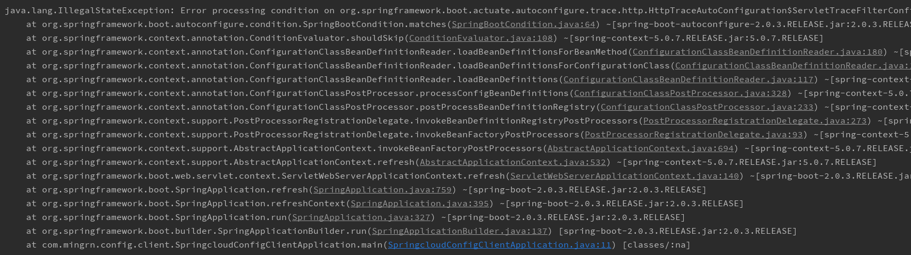

# Spring Cloud Config Client

在 [springcloud-config-server](../springcloud-config-server) 中有介绍说 Spring Cloud Config 分为 服务端与客户端。服务点已经介绍过了，现在来看下客户端。

# 创建 Spring Cloud Config 客户端

在 Idea 工具下，创建 Spring Boot 工程是勾选 Config Client 即可：


或者直接在 pom 文件中直接引入依赖：

```xml
<dependency>
    <groupId>org.springframework.cloud</groupId>
    <artifactId>spring-cloud-starter-config</artifactId>
</dependency>
```

修改启动类方式：

```java
@SpringBootApplication
public class SpringcloudConfigClientApplication {

	public static void main(String[] args) {
		new SpringApplicationBuilder(SpringcloudConfigClientApplication.class).web(WebApplicationType.SERVLET).run(args);
	}
}
```

> 之前有说过采用这种方式的原因，这里不多说。注意一点，之前是 `.web(true)` 这种形式，不过在这个版本已经过时了。

接着修改配置文件，如下：

```properties
server.port=7002
spring.application.name=config
spring.cloud.config.profile=prod
spring.cloud.config.label=master
spring.cloud.config.uri=http://127.0.0.1:7001
```

- `spring.application.name`：对应服务端配置文件规则的 {application}
- `spring.cloud.config.profile`：对应服务端配置文件规则的 {profile}
- `spring.cloud.config.label`：对应服务端配置文件夫子的 {label}
- `spring.cloud.config.uri`：配置中心 config-server 的地址

>**注意：** 这里的配置文件为 `bootstrap.properties` 而不是之前的 `application.properties`，原因是 `bootstrap` 配置文件加载顺序优于 `application`。这样 config-server 中的配置信息才能配正常加载，因为从 config-server 获取的外部信息优先级比本地要高。如果依然采用之前的方式配置中心信息无法正常加载启动时会报异常。

增加测试类 `TestController`：

```java
@RefreshScope
@RestController
@RequestMapping
public class TestController {

	@Value("${from}")
	private String from;

	@RequestMapping("/from")
	public String from() {
		return this.from;
	}
}
```

在这个测试类中采用 `@Value` 注解获取配置中心 `from` 的值，如果在之前的配置文件中使用的依然是 `application.properties` 在启动时就会出现如下异常：

```log
Caused by: java.lang.IllegalArgumentException: Could not resolve placeholder 'from' in value "${from}"
```

另外，在类上笔者增加了 `@RefreshScope` 注解，这个注解是用来动态更新配置属性的，用于微服务客户端配置自动更新,解决资源文件与javaConfig的同步问题。

在增加这个注解后为了让 `${from}` 属性值能够起到动态刷新配置中心的属性值，我们还需要在 pom 依赖中引入 `spring-boot-starter-actuator`

```xml
<dependency>
    <groupId>org.springframework.boot</groupId>
    <artifactId>spring-boot-starter-actuator</artifactId>
</dependency>
```

接着需要在配置文件中增加如下配置用于暴露监控的端点，默认只暴露 `health` 和 `info` 两个端点，这里笔者让 actuator 监控暴露所有端点，所以使用了 `*`

```properties
#默认值 ["health",info]
#management.endpoints.web.exposure.include=["health",info]
#暴露所有端点
management.endpoints.web.exposure.include=*
```

>**注意：** 为了测试需要，笔者在之前的配置中心 config-server 中同样增加了该依赖和配置。

在启动服务之前需要说一点，在构建工程时由于只勾线了 `config client`，所以在 pom 中并没有引入 `spring-boot-starter-web` 依赖，这里需要在依赖中引入该依赖，不然启动时会报异常：



现在，一切准备就绪，就来启动客户端服务(在启动该客户端服务之前先启动config配置中心[springcloud-config-server](../springcloud-config-server))。
在启动时在控制台会输出获取配置中心配置的日志信息：

```log
Fetching config from server at : http://127.0.0.1:7001
Located environment: name=config, profiles=[prod], label=master, version=5787a06f2b82bc8caf50482d214acb0abed2599e, state=null
```

> 从配置中心获取配置信息，并且打印了应用名称、分支名称、版本号。

以及 actuator 监控暴露的所有端点信息：


在这些暴露的端点中其中有个 refresh POST 请求类型的端点，这个端点是这里测试需要的，也就是动态刷新！

现在，配置中心与客户端都已经启动成功，先访问配置中心 master 分支的 prod URL:`http://127.0.0.1:7001/config/prod`：

```json
{
    "name": "config",
    "profiles": [
        "prod"
    ],
    "label": null,
    "version": "5787a06f2b82bc8caf50482d214acb0abed2599e",
    "state": null,
    "propertySources": [
        {
            "name": "https://gitee.com/mingrn/springcloud-config-server/spring-cloud-in-action/config-repo/config-prod.properties",
            "source": {
                "from": "git-prod-1.0"
            }
        },
        {
            "name": "https://gitee.com/mingrn/springcloud-config-server/spring-cloud-in-action/config-repo/config.properties",
            "source": {
                "from": "git-default-1.0"
            }
        }
    ]
}
```

再访问客户端的测试接口，URL：`http://127.0.0.1:7002/from`，可以看到成功获取到配置中心中的 form 属性值：

```
git-prod-1.0
```

为了测试动态更新是否起到作用，修改配置中心的 from 值为：`git-prod-2.0`，服务端先请求测试是否被修改：

```json
{
    "name": "config",
    "profiles": [
        "prod"
    ],
    "label": null,
    "version": "5787a06f2b82bc8caf50482d214acb0abed2599e",
    "state": null,
    "propertySources": [
        {
            "name": "https://gitee.com/mingrn/springcloud-config-server/spring-cloud-in-action/config-repo/config-prod.properties",
            "source": {
                "from": "git-prod-2.0"
            }
        },
        {
            "name": "https://gitee.com/mingrn/springcloud-config-server/spring-cloud-in-action/config-repo/config.properties",
            "source": {
                "from": "git-default-1.0"
            }
        }
    ]
}
```

可以看到form被修改了，现在我们来更新下客户端的属性值。还记得之前客户端控制台打印的端点？不记得了？那就先看下客户端的端点信息，访问`http://127.0.0.1:7002/actuator/`查看所有监控端点信息：

```json
{
    "_links": {
        "self": {
            "href": "http://127.0.0.1:7002/actuator",
            "templated": false
        },
        "auditevents": {
            "href": "http://127.0.0.1:7002/actuator/auditevents",
            "templated": false
        },
        "beans": {
            "href": "http://127.0.0.1:7002/actuator/beans",
            "templated": false
        },
        "health": {
            "href": "http://127.0.0.1:7002/actuator/health",
            "templated": false
        },
        "conditions": {
            "href": "http://127.0.0.1:7002/actuator/conditions",
            "templated": false
        },
        "configprops": {
            "href": "http://127.0.0.1:7002/actuator/configprops",
            "templated": false
        },
        "env": {
            "href": "http://127.0.0.1:7002/actuator/env",
            "templated": false
        },
        "env-toMatch": {
            "href": "http://127.0.0.1:7002/actuator/env/{toMatch}",
            "templated": true
        },
        "info": {
            "href": "http://127.0.0.1:7002/actuator/info",
            "templated": false
        },
        "loggers": {
            "href": "http://127.0.0.1:7002/actuator/loggers",
            "templated": false
        },
        "loggers-name": {
            "href": "http://127.0.0.1:7002/actuator/loggers/{name}",
            "templated": true
        },
        "heapdump": {
            "href": "http://127.0.0.1:7002/actuator/heapdump",
            "templated": false
        },
        "threaddump": {
            "href": "http://127.0.0.1:7002/actuator/threaddump",
            "templated": false
        },
        "metrics-requiredMetricName": {
            "href": "http://127.0.0.1:7002/actuator/metrics/{requiredMetricName}",
            "templated": true
        },
        "metrics": {
            "href": "http://127.0.0.1:7002/actuator/metrics",
            "templated": false
        },
        "scheduledtasks": {
            "href": "http://127.0.0.1:7002/actuator/scheduledtasks",
            "templated": false
        },
        "httptrace": {
            "href": "http://127.0.0.1:7002/actuator/httptrace",
            "templated": false
        },
        "mappings": {
            "href": "http://127.0.0.1:7002/actuator/mappings",
            "templated": false
        },
        "refresh": {
            "href": "http://127.0.0.1:7002/actuator/refresh",
            "templated": false
        },
        "features": {
            "href": "http://127.0.0.1:7002/actuator/features",
            "templated": false
        }
    }
}
```

其中的 `refresh` 端点是 POST 请求类型，现在我们请求一下 POST请求：`http://127.0.0.1:7002/actuator/refresh`，控制台会打印如下信息：


这些信息告诉你，已将本地客户端配置信息进行了摧毁并且重新从远程配置中心拉取了一份。现在来验证下 from 属性是否被成功刷新，再次请求：`http://127.0.0.1:7002/from` 就会看到返回值为 `git-prod-2.0` 说明动态刷新确实起到了作用。

通过客户端动态刷新方式，当配置中心的配置进行修改时，这样以后再修改配置中心配置时就不需要重启客户端了（妈妈再也不用担心我重启客户端了）！