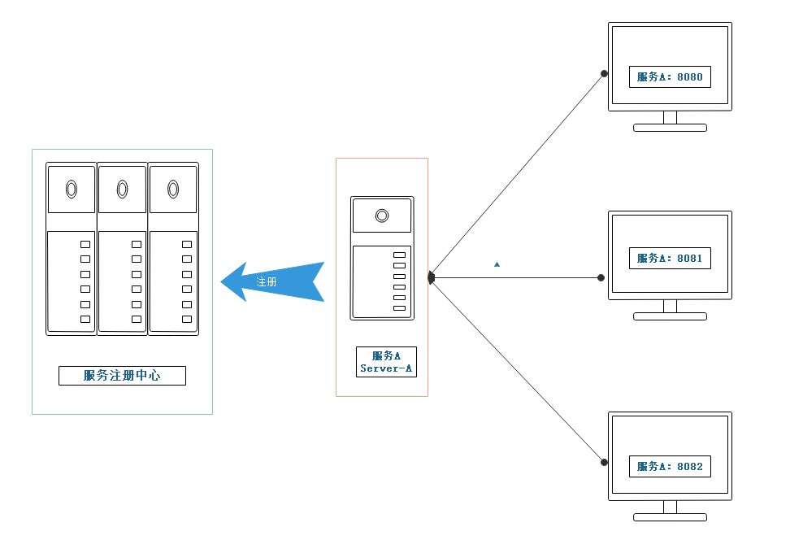
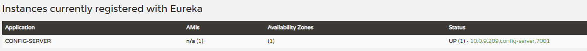
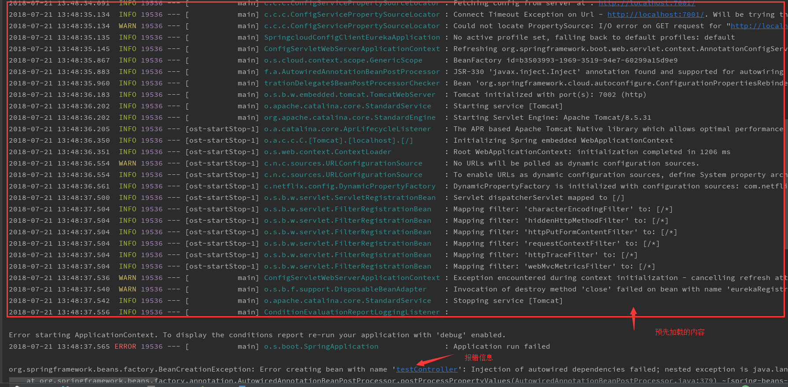
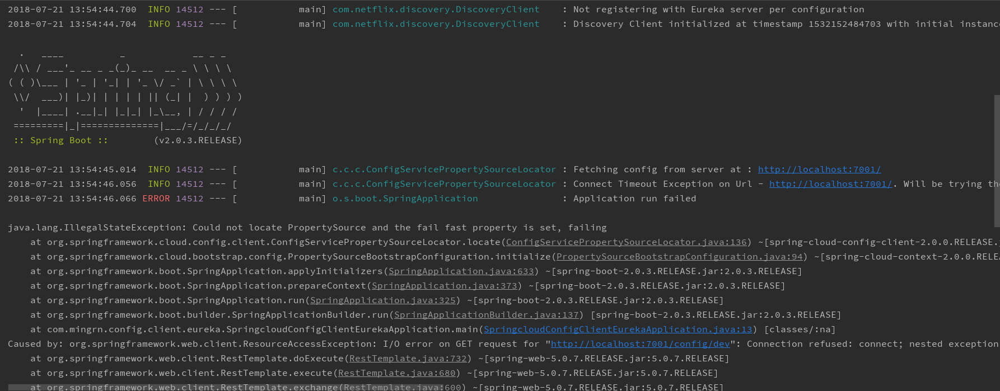
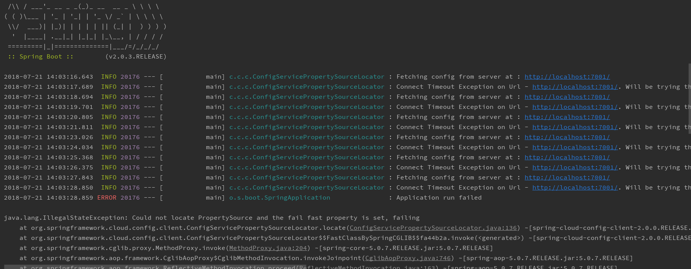

# Spring Cloud Config 高可用配置

在 [springcloud-config-server](../springcloud-config-server) 和 [springcloud-config-client](../springcloud-config-client) 两个工程中讲解了 Config 配置中心 服务端与客户端 的基本用法与在配置
过程中的注意事项。那本节就讲下 Spring Cloud Config 如何做到高可用！

还记得在最开始的时候有介绍 服务注册中心的高可用配置 吗？了解的话就应该知道所谓的高可用配置就是将自己注册成一个服务的多个实例！什么意思？看下图：



同样的，在 Config 配置中心也同样能做到这点。这样，当一个配置中心宕机的时候依然有实例提供运转。

---

本工程是 [springcloud-config-server](../springcloud-config-server) 的一份拷贝，这里直接在其基础上做些改造！

在 pom 文件中引入 `eureka` 依赖，这里将两个依赖全部引入，实际上只引入 `spring-cloud-starter-netflix-eureka-server` 即可！

```xml
<dependency>
    <groupId>org.springframework.cloud</groupId>
    <artifactId>spring-cloud-starter-netflix-eureka-client</artifactId>
</dependency>
<dependency>
    <groupId>org.springframework.cloud</groupId>
    <artifactId>spring-cloud-starter-netflix-eureka-server</artifactId>
</dependency>
```

在启动类上加 `@EnableDiscoveryClient` 用于服务注册发现

```java
@EnableConfigServer
@EnableDiscoveryClient
@SpringBootApplication
public class SpringcloudConfigServerEurekaApplication {

	public static void main(String[] args) {
		SpringApplication.run(SpringcloudConfigServerEurekaApplication.class, args);
	}
}
```

修改配置文件

```properties
server.port=7001
spring.application.name=config-server
eureka.instance.hostname=localhost
##服务注册中心地址
eureka.client.service-url.defaultZone=http://${eureka.instance.hostname}:8888/eureka
##Git配置中心管理
spring.cloud.config.server.git.uri=https://gitee.com/mingrn/springcloud-config-server
#远程仓库配置文件的相对路径
spring.cloud.config.server.git.search-paths=spring-cloud-in-action/config-repo
#本地存储clone临时文件路径
spring.cloud.config.server.git.basedir=/AppData/Local/Temp/config-repo
#Git username and password
spring.cloud.config.username=username
spring.cloud.config.password=******
```

>**注意：** 为了测试方便这里将 security 移除，注意看下 pom 文件依赖！

启动服务注册中心 [springcloud-eureka](../springcloud-eureka)，并启动该配置中心



在服务注册中心中看到该服务即表示完成！现在再来改造 Config 客户端[springcloud-config-client](../springcloud-config-client) 工程，命名为 [springcloud-config-client-eureka](../springcloud-config-client-eureka)。

在pom 文件中同样引入 `eureka`

```xml
<dependency>
    <groupId>org.springframework.cloud</groupId>
    <artifactId>spring-cloud-starter-netflix-eureka-client</artifactId>
</dependency>
<dependency>
    <groupId>org.springframework.cloud</groupId>
    <artifactId>spring-cloud-starter-netflix-eureka-server</artifactId>
</dependency>
```

在启动类上增加 `@EnableDiscoveryClient` 注解用于服务发现

```java
@EnableDiscoveryClient
@SpringBootApplication
public class SpringcloudConfigClientEurekaApplication {

	public static void main(String[] args) {
		new SpringApplicationBuilder(SpringcloudConfigClientEurekaApplication.class).web(WebApplicationType.SERVLET).run(args);
	}
}
```

修改配置文件 `bootstrap.properties`

```properties
server.port=7002
spring.application.name=config
eureka.instance.hostname=localhost
#注册 Eureka 服务
eureka.client.service-url.defaultZone=http://${eureka.instance.hostname}:8888/eureka
#Config
spring.cloud.config.discovery.enabled=true
spring.cloud.config.discovery.service-id=config-server
spring.cloud.config.profile=dev
```

> - `eureka.client.service-url.defaultZone`：服务注册中心地址
> - `spring.cloud.config.discovery.enabled`：开启服务访问 Config Server 功能
> - `spring.cloud.config.discovery.service-id`：指定 Config Server 注册中心服务名
> - `spring.cloud.config.profile`：如之前一样，用于定位 Git 中的资源

现在启动该配置客户端，在服务注册中心同样能看到该实例！访问：`localhost:7002/from`，此时会返回在 Git 仓库中 config-dev.properties 文件中配置的 from 属性值：`git-dev-1.0`。

# 失败快速响应与重试机制

Spring Config 客户端在加载时在开始连接 Config Server 进行属性注入时会预先加载其他信息。当创建的应用较为复杂时，可能在连接 Config Server 之前花费较长的启动时，当加载完成后开始加载 Server 连接
时可能由于各种原因处于宕机状态，无法正常提供服务。这样，预先加载也是夯货！所以，我们可以在测试在正常连接 Config Server 后再进行加载这些信息！

在 配置文件中增加 `spring.cloud.config.fail-fast` 配置，便能实现客户端优先判断 Config Server 获取是否正常，并快速响应失败内容！

```properties
#快速响应ConfigServer
spring.cloud.config.fail-fast=true
```

现在，可以测试一下将 Config Server 服务关闭，在客户端将快速响应注释，直接启动客户端。可以获取如下报错信息，同时，在报错之前，可以看到客户端应用已经加载了很多内容！



现在，将快速响应开启，重启客户端应用，看到如下报错信息：



从报错信息中可以看到，在报错之前并没有加载任何信息。只是进行了一次测试连接 Config Server，在连接失败时直接抛出了异常信息！说明 **快速响应** 确实起到了作用！

但是，仅仅这样进行并不合理！在测试 Config Server 宕机或是客户端配置不正确是导致连接不到而启动失败的情况，快速响应的配置确实发挥比较好的作用！但是，如果由于网络波动等其他间接性原因就导致启动失败似乎花费的代价有点高！
所以， Config 客户端还提供了对应的自动重试的功能，在开启重启的前提下，需要保证已经开启了快速响应配置：`spring.cloud.config.fail-fast=true`。

在客户端 pom 文件中引入 `spring-retry` 和 `spring-boot-starter-aop` 依赖：

```xml
<dependency>
    <groupId>org.springframework.retry</groupId>
    <artifactId>spring-retry</artifactId>
</dependency>
<dependency>
    <groupId>org.springframework.boot</groupId>
    <artifactId>spring-boot-starter-aop</artifactId>
</dependency>
```

不需要做任何操作重启客户端，看到如下异常信息：



在启动客户端是，进行尝试连接 Config Server，当连接失败时进行重新连接，直到第六次才抛出异常信息！说明重试机制启动了作用！这里默认情况下重试机制为六次。如果对重试机制不满意还可以通过以下几个属性进行配置！

```properties
spring.cloud.config.retry.max-attempts=6
spring.cloud.config.request-read-timeout=0
spring.cloud.config.retry.initial-interval=1000
spring.cloud.config.retry.multiplier=1.1
spring.cloud.config.retry.max-interval=2000
```

> - `spring.cloud.config.retry.max-attempts`：重试连接次数,默认6次
> - `spring.cloud.config.request-read-timeout`：请求超时时间,默认0毫秒
> - `spring.cloud.config.retry.initial-interval`：初始重试间隔时间,默认1000毫秒
> - `spring.cloud.config.retry.multiplier`：下一间隔的乘数,默认1.1,所以当最初间隔时间是1000毫秒时,下一次失败的间隔时间为1100毫秒
> - `spring.cloud.config.retry.max-interval`：最大间隔时间,默认为2000毫秒