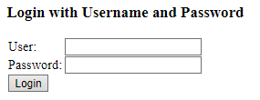
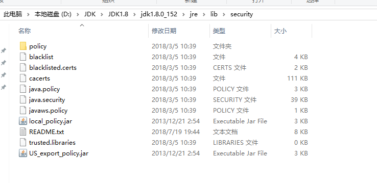
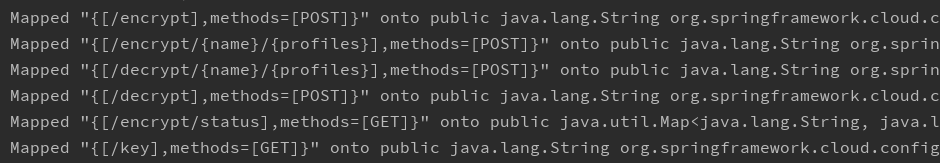
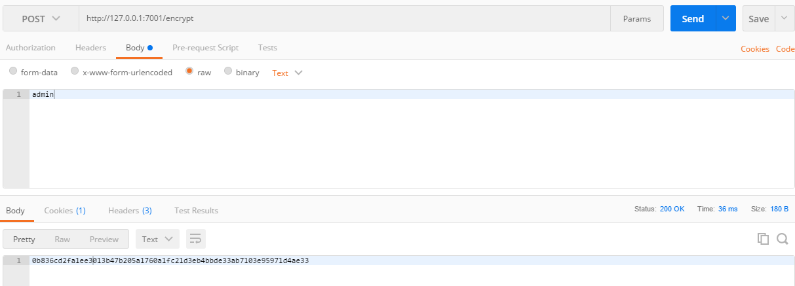
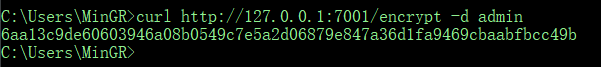
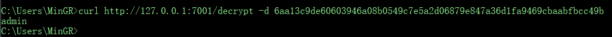

# Spring Cloud Config Server

在分布式系统中，每一个功能模块都能拆分成一个独立的服务，一次请求的完成，可能会调用很多个服务协
调来完成，为了方便服务配置文件统一管理，更易于部署、维护，所以就需要分布式配置中心组件 一一 spring cloud config。

spring cloud config 是用来为分布式系统中的基础设施和微服务应用提供集中化的外部配置支持，它分为服务端与客户端。

其中服务端也成为分布式配置中心，它是个独立的微服务应用，用来连接配置仓库并为客户端提供获取配置信息、
加密&解密信息等访问接口；而客户端则是微服务架构中的各个微服务应用或基础设施，他们通过指定的配置中心
来管理应用资源与业务相关的配置内容，并在启动的时候从配置中心获取和加载配置信息。


Spring Cloud Config 支持配置文件放在在配置服务的内存中，也支持放在远程Git仓库里。引入
spring cloud config后，我们的外部配置文件就可以集中放置在一个git仓库里，再新建一个 
config server，用来管理所有的配置文件，维护的时候需要更改配置时，只需要在本地更改后，推送
到远程仓库，所有的服务实例都可以通过config server来获取配置文件，这时每个服务实例就相当于
配置服务的客户端config client,为了保证系统的稳定，配置服务端config server可以进行集群
部署，即使某一个实例，因为某种原因不能提供服务，也还有其他的实例保证服务的继续进行。

如下架构图：


**本工程只介绍服务端**

> 由于 Spring Cloud Config 实现的配置中心默认采用 Git 来存储配置信息，所以 Config 构建的
配置服务器天然就支持对微服务应用配置信息的版本管理，并且可以通过 Git 客户端工具来方便的管理和访问配置内。

# 创建 Spring Could Config 服务端

在 Idea 工具下，创建工程是直接勾选 Config Server 即可：


或者在 pom 文件中直接引入依赖：

```xml
<dependency>
    <groupId>org.springframework.cloud</groupId>
    <artifactId>spring-cloud-config-server</artifactId>
</dependency>
```

工程创建完成后在启动类上加上 `@EnableConfigServer` 直接开启 Spring Cloud Config **服务端** 功能。

```java
@EnableConfigServer
@SpringBootApplication
public class SpringcloudConfigServerApplication {

	public static void main(String[] args) {
		SpringApplication.run(SpringcloudConfigServerApplication.class, args);
	}
}
```

接着在配置文件中增加如下配置信息：

```properties
server.port=7001
spring.application.name=config-server
spring.cloud.config.server.git.uri=https://gitee.com/mingrn/springcloud-config-server
spring.cloud.config.server.git.search-paths=spring-cloud-in-action/config-repo
spring.cloud.config.server.git.username=username
spring.cloud.config.server.git.password=******
```

> - `spring.cloud.config.server.git.uri`：仓库地址，这里使用的是gitee
> - `spring.cloud.config.server.git.search-paths`：git仓库下配置文件所在目录,采用相对路径
> - `spring.cloud.config.server.git.username`：git仓库登录账号
> - `spring.cloud.config.server.git.password`：git仓库登录密码

在配置文件中 `spring.cloud.config.server.git.search-paths` 所指的相对路径是基于仓库位置，比如这里的仓库名称为 springcloud-config-server，
而配置文件所处的位置在 `springcloud-config-server/spring-cloud-in-action/config-repo` 目录下，那么相对路径为 `/spring-cloud-in-action/config-repo`,支持多个相对路径,多个相对路径之间需要中逗号做分隔！

如图：


通过 git 工具创建如下文件（或者直接在网页创建）并推送至远程仓库：

- `config.properties`
- `config-dev.properties`
- `config-prod.properties`
- `config-test.properties`

在三个配置文件中分别设置不同的值：

- `fromf = git-default-1.0`
- `fromf = git-dev-1.0`
- `fromf = git-prod-1.0`
- `fromf = git-test-1.0`

成功推送至远程仓库后就能看到上图所示页面信息，接着在创建一个 `test` 分支


并将 test 分支上的三个配置文件内容分别修改为如下内容：

- `from = git-default-test-1.0`
- `from = git-dev-test-1.0`
- `from = git-prod-test-1.0`
- `from = git-test-test-1.0`

提交并推送至远程，如下：


为了测试版本控制，笔者在仓库中创建了两个分支分别是 master 和 test，完成上面的工作后启动服务，并
在浏览器中或通过 POSTMan 工具访问我们配置的内容。访问配置信息的 URL 与配置文件的映射关系如下：

- `/{application}/{profile}[/label]`
- `/{application}-{profile}.[yml|properties]`
- `/{label}/{application}-{profile}.[yml|properties]`

其中，`{application}` 指的是配置文件前缀，比如笔者创建的配置文件名称分别是 `config.properties`、`config-dev.properties`,
这里的 `{application}` 指的就是 `config`。
`{profile}` 则指的是后缀 `dev`。`/label` 这指的是分支，比如 master、test 分支。

> `[]` 符号同正则表达式

现在笔者样访问 `test` 分支, `config` 应用的 `prod` 环境，就可以访问URL：`http://127.0.0.1:7001/config/prod/test`,就会返回如下信息：

```json
{
    "name": "config",
    "profiles": [
        "prod"
    ],
    "label": "test",
    "version": "ed4c5b1c976664a5e25b17f9d7ceb5da38813f5a",
    "state": null,
    "propertySources": [
        {
            "name": "https://gitee.com/mingrn/springcloud-config-server/spring-cloud-in-action/config-repo/config-prod.properties",
            "source": {
                "from": "git-prod-test-1.0"
            }
        },
        {
            "name": "https://gitee.com/mingrn/springcloud-config-server/spring-cloud-in-action/config-repo/config.properties",
            "source": {
                "from": "git-default-test-1.0"
            }
        }
    ]
}
```

可以看到其中返回的信息包含了应用名称：`config`,分支：`test`,版本号等信息。

**注意：** URL 映射路径 label 默认值为 master,所以当将之前的访问 URL 最后的 `/test` 去除访问的就会是 `/master`。

如下：`http://127.0.0.1:7001/config/prod`

```json
{
    "name": "config",
    "profiles": [
        "prod"
    ],
    "label": null,
    "version": "94c2d548363b05668694f093f1313d814ca86491",
    "state": null,
    "propertySources": [
        {
            "name": "https://gitee.com/mingrn/springcloud-config-server/spring-cloud-in-action/config-repo/config-prod.properties",
            "source": {
                "from": "git-prod-1.0"
            }
        },
        {
            "name": "https://gitee.com/mingrn/springcloud-config-server/spring-cloud-in-action/config-repo/config.properties",
            "source": {
                "from": "git-default-1.0"
            }
        }
    ]
}
```

另外一点，每次访问时，配置服务器都会 Git 中获取配置信息后，都会存储一份在 config-server 的文件系统中，实质上 config-server 是通过 `git clone` 命令将配置内容克隆一份在本地存储，然后回去这些内容并
返回给微服务应用进行加载，日志如下：


现在访问这个目录就会看到本地克隆的文件


通过 Git 在本地仓库暂存，可以有效访问当 Git 仓库出现故障而已引起无法加载配置信息的情况。现在断开网络在重新请求一次，会看到控制台输出日下信息：


虽然提示无法从远程获取该分支内容的报错信息：

```log
Could not fetch remote for master remote:
```

但是依然会为该请求返回配置信息，这些内容源于之前访问存在于 config-server 本地文件的拷贝。

---

在之前的配置文件中，笔者是直接使用的远程仓库地址，其实在测试或者开发中也可以直接使用本地仓库，配置如下：

```properties
server.port=7001
spring.application.name=config-server
spring.cloud.config.server.git.uri = file:///${user.home}/AppData/Local/Temp/config-repo-5452474400930930259
spring.cloud.config.server.git.search-paths=spring-cloud-in-action/config-repo
```

这里使用的是之前远程的一份拷贝，启动程序会看到能够正常启动，并且控制台会打印提示信息：


访问也是能正常访问的,但是需要注意的是这仅仅只能用于开发和测试无法再线上使用：

```json
{
    "name": "config",
    "profiles": [
        "prod"
    ],
    "label": null,
    "version": "94c2d548363b05668694f093f1313d814ca86491",
    "state": null,
    "propertySources": [
        {
            "name": "file:///C:\\Users\\MinGR/AppData/Local/Temp/config-repo-5452474400930930259/spring-cloud-in-action/config-repo/config-prod.properties",
            "source": {
                "from": "git-prod-1.0"
            }
        },
        {
            "name": "file:///C:\\Users\\MinGR/AppData/Local/Temp/config-repo-5452474400930930259/spring-cloud-in-action/config-repo/config.properties",
            "source": {
                "from": "git-default-1.0"
            }
        }
    ]
}
```

另外，在将远程仓库配置文件clone到本地时生成时，这些文件默认会被存储在 `config-repo-<随机数>` 的目录中。由于其随机性以及临时目录的特性，可能会出现不可预知的后果，为了避免会出现这种后果，最好的办法就是制定一个固定的位置来存储
这些重要信息。我们只需要通过 `spring.cloud.config.server.git.basedir` 来配置一个我们准备好的目录即可。配置如下：

```properties
server.port=7001
spring.application.name=config-server
spring.cloud.config.server.git.uri=https://gitee.com/mingrn/springcloud-config-server
spring.cloud.config.server.git.search-paths=spring-cloud-in-action/config-repo
spring.cloud.config.server.git.basedir=/AppData/Local/Temp/config-repo
spring.cloud.config.server.git.username=username
spring.cloud.config.server.git.password=******
```

---

**本地仓库配置与采坑**

在配置本地仓库时，使用的参数如下：

```properties
spring.cloud.config.server.git.uri = file:///${user.home}/AppData/Local/Temp/config-repo-5452474400930930259

```

在 windows 下 `file:///` 这里必须跟三个斜杠，Linux则双斜杠即可。另外，`${user.home}` 环境变量指的是当前用户环境目录，如果你不知道在哪，那就直接在 CMD 终端命令
中输入：`start.` 指令就会直接弹出当前用户目录，另外路径什么的都设置好以后并没有完事，你需要确定你所指定的本地仓库是否有指向远程仓库的信息，即 `.git` 目录。你使用远程
仓库时，每次克隆本地都会有 .git 目录。这里要注意下！


# security 安全认证、加密与解密

>**说明：** 本节内容为后续扩展补充，在阅读本届之前请先保证对 Config 配置客户端应用已经有些了解或者先阅读 [Config 配置客户端](../springcloud-config-client) 之后再回来阅读本节！

由于配置中心存储的内容比较敏感，所以做一些安全处理是必须的。因为 Spring Cloud 微服务引用是在 Spring Boot 基础之上，所以这里直接采用 security。在 pom 文件中引入 `spring-boot-starter-security` 依赖：

```xml
<dependency>
    <groupId>org.springframework.boot</groupId>
    <artifactId>spring-boot-starter-security</artifactId>
</dependency>
```

引入该依赖之后，对配置内容不需要做任何操作，直接重启应用。现在在此访问 `http://127.0.0.1:7001/actuator` 时，出现了登录界面



默认用户名为 user，密码则是打印在控制台上


现在输入登录账号与密码之后就能访问了，配置中心由于做了安全验证，现在客户端应用是无法直接访问该服务的，所以同样的需要修改客户端配置内容。只需要在客户端配置中增加两项配置即可！

```properties
spring.cloud.config.username=user
spring.cloud.config.password=37d6b840-12dd-4099-82fd-bb2d0f98be4b
```

- `spring.cloud.config.username`：配置中心安全登录验证账号
- `spring.cloud.config.password`：配置中心安全登录验证密码

现在重启客户端应用同样能够顺利访问了！

默认的安全验证可能不够友好，比如密码！当然，这些事可控的，如：

```properties
spring.security.user.name=root
spring.security.user.password=admin
```

现在，就重启配置中心输入在配置中心配置的账号密码成功登陆！虽然引入了安全验证机制，同样的出现了一个问题，就是密码暴露问题！

在微服务应用中，基本上每个微服务应用都会有开发人员维护。这同样的会暴露敏感数据问题，比如数据库密码！

针对这个问题，Spring Cloud 同样提供了对属性进行加密解密功能，以保护配置文件的信息安全。就以之前的配置安全验证的登录账号密码问题，可以加密密码，如下：

```properties
spring.cloud.config.username=user
spring.cloud.config.password={cipher}11d1c987314dcf21dba87e84c0d329fc4c1075b6cf3c3fb4b9f78948097c5ec4
```

在 Spring Cloud 中，通过在属性值前面加上 `{cipher}` 做前缀来标注该内容是一个加密值，当微服务客户端加载配置时，配置中心会自动为带有 `{cipher}` 前缀的属性值进行解密。通过该机制
运维人员就能放心的将线上数据的加密资源交给微服务团队，我不需要担心这些敏感数据暴露问题。

**使用前提**

在使用 Spring Cloud 的加密解密功能时，有一个必要的前提需要注意。为了使用该功能我们需要在配置中心运行环境中安装不限长度的 JCE 版本。虽然 JRE 中自带 JCE 功能，但是默认使用的是有限长度的版本。我们需要在 Oracle 官网上下载，比如，该工程的运行环境是 JDK8，那笔者就需要在 Oracle 官网中现在对应的 [JCE8 版本](http://www.oracle.com/technetwork/java/javase/downloads/jce8-download-2133166.html)，这里已经下载对应的 [jce_policy-8](files/jce_policy-8.zip) 

现在后解压，或看到有三个文件：

>- `README.txt`
>- `local_policy.jar`
>- `US_export_policy.jar`

将这两个jar文件拷贝到 `JAVA_HOME/jre/lib/security` 覆盖原来的文件(如果有的话记得将原来的做备份)



如果想要测试 JCE 功能是否能否使用，在工程下有个 `TestJCEMain` 类，运行如果没有异常说明成功！到这里准备工作即完成了！

**相关端点**

在 JCE 安装完成后，重启配置中心。在控制台中，会有如下端点信息：



> - `key`：查看密匙端点
> - `encrypt`：POST请求 对请求的 Body 体进行加密
> - `decrypt`：POST请求 对请求的 Body 体进行解密
> - `encrypt/status`：查看加密功能端点状态

访问：`127.0.0.1:7001/encrypt/status`，会返回如下信息

```json
{
    "description": "No key was installed for encryption service",
    "status": "NO_KEY"
}
```

原因是因为没有配置 `encrypt.key`,现在在 `bootstrap.properties` 或者 `bootstrap.yml` 配置文件中增加该配置属性

```properties
# 值任意
encrypt.key=permit
```

重启服务，再次访问就会返回如下信息：

```json
{
    "status": "OK"
}
```

>**注意：** 该 `encrypt.key` 属性一定要加载 `bootstrap` 的配置文件中，笔者之前一直是访问 `application` 的配置文件中，不管怎么请求都如法返回 OK 信息，这里要注意一下！
另外，在做该测试之前最好将安全验证关掉，否则每次访问否会要求登录验证不便于后续测试！

现在，我们的配置中心加解密功能就能使用了，不妨使用 POSTMan 工具 或者 CURL 发送POST 请求测试(请求体为 Body)：

POSTMan 工具请求加密



CURL 请求加密



会看到同样的明文，每次请求的密文都不一样。由于是对称加密，所以我们可以访问 `decrypt` 端点进行解密



现在，开启 security 安全验证，在配置密码时使用如下配置：

```properties
spring.security.user.password={cipher}6aa13c9de60603946a08b0549c7e5a2d06879e847a36d1fa9469cbaabfbcc49b
```

在登录时，登录密码输入 admin，测试能够成功登录说明没问题。接着修改 Config 客户端，在配置文件中将配置密码改为该密文，重启客户端，测试能够成功登录认证！

> **注意：**客户端配置文件中同样需要增加 `encrypt.key` 属性配置，值为在配置中心配置的值，并且同样的要配置在 `bootstrap.properties` 配置文件中。

这里使用了对称加密，使用该对称加密我们可以加密数据库密码等一切敏感数据！