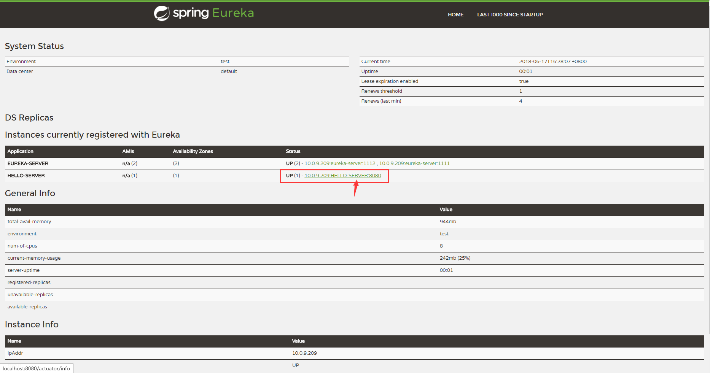

# springcloud-eureka-peer-service 高可用服务提供者

在高可用注册中心（[springcloud-eureka-peer](../springcloud-eureka-peer)）中，两个注册中心已经成功互相注册。
现在怎么将服务同时注册到这两个服务中心呢？

将单节点服务注册提供者（springcloud-eureka-service）模块拷贝一份。
直接修改配置文件如下：

```profile
server.port=8080
spring.application.name=HELLO-SERVER
eureka.instance.hostname=localhost
eureka.client.service-url.defaultZone=http://${eureka.instance.hostname}:1111/eureka,http://${eureka.instance.hostname}:1112/eureka
```

上面配置主要对 `eureka.client.service-url.defaultZone` 属性做了改动，将服务注册中心指向了之间建立的 `peer1` 和 `peer2`。

下面直接启动服务访问 `localhost:8080` 就能分别在服务注册中心 `peer1` 和 `peer2` 看到该服务已经成功注册

如图：



若此时将服务中心 `peer1` 断开，由于该服务同时注册到了服务中心 `peer2`，因此在服务注册中心 peer2 上的其他服务依然能访问到该服务，从而实现了服务注册中心的高可用。

> **注意：** 如果我们不想使用主机名来定义注册中心的地址，也可以使用 IP 地址形式，但是需要在配置文件中增加配置参数`eureka.instance.prefer-ip-address=true`，该值默认 false
