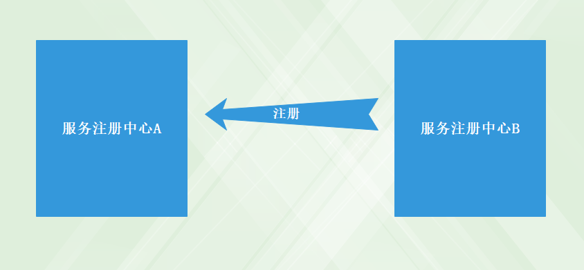
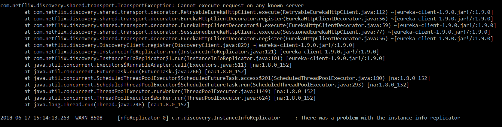
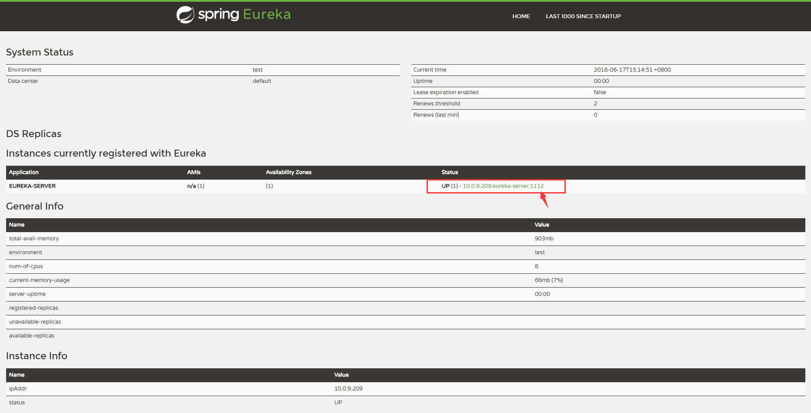
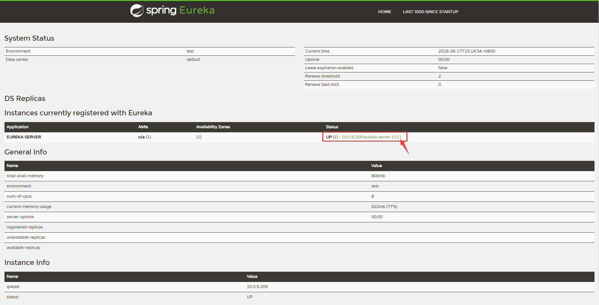

# springcloud-eureka-peer 高可用注册中心

在之前的注册中心实例（[springcloud-eureka](../springcloud-eureka)）中使用的是单节点配置，因为我们在服务注册中心增加了下面这两个参数，让服务中心不注册自己：

```profile
eureka.client.register-with-eureka=false
eureka.client.fetch-registry=false
```
Eureka Server 的高可用实际上就是 **将自己作为服务向其他服务中心注册自己** ，这样就形成了一组互相注册的服务注册中心，以实现服务清单的互相同步，达到高可用的效果。



# 构建高可用的服务注册中心的集群

将之前的 **springcloud-eureka** 直接拷贝一份。 `application.properties` 配置文件如下：

```profile
server.port=8888
spring.application.name=eureka-server
eureka.instance.hostname=localhost
eureka.client.service-url.defaultZone=http://${eureka.instance.hostname}:${server.port}/eureka
```

前面说了，高可用实际上就是将自己作为服务向其他服务中心注册自己。因此，需要将下面的两句配置去掉或者都改为true。

```profile
eureka.client.register-with-eureka=false
eureka.client.fetch-registry=false
```

* 创建 application-peer1.properties，作为 peer1 服务中心的配置，并将 service-url 指向 peer2

```profile
server.port=1111
spring.application.name=eureka-server
eureka.instance.hostname=localhost
eureka.client.service-url.defaultZone=http://${eureka.instance.hostname}:1112/eureka
```

* 创建 application-peer2.properties，作为 peer2服务中心的配置，并将 service-url 指向 peer1

```profile
server.port=1112
spring.application.name=eureka-server
eureka.instance.hostname=localhost
eureka.client.service-url.defaultZone=http://${eureka.instance.hostname}:1111/eureka
```

将 `springcloud-eureka-peer` 模块打成 jar 包。

* 通过 `spring.profiles.active` 属性分别启动 `peer1` 和 `peer2`

```
java -jar springcloud-eureka-peer-0.0.1-SNAPSHOT.jar --spring.profiles.active=peer1
java -jar springcloud-eureka-peer-0.0.1-SNAPSHOT.jar --spring.profiles.active=peer2
```

> **注意：** 当启动其中一个的时候因为注册中心还没起来因此会报异常，这个不需要关心。当服务中心起来后就可以了。

譬如，执行命令 `java -jar springcloud-eureka-peer-0.0.1-SNAPSHOT.jar --spring.profiles.active=peer1` 程序在启动过程中控制台会输出如下异常信息：



不用管它，接着直接执行命令启动 `peer2` 即可。

分别访问 `localhost:1111` 和 `localhost:1112` 会分别在看到对方成功被注册到自己

如图：

* **peer1**



* **peer2**



----

接着来看下高可用服务提供者 [springcloud-eureka-peer-service](../springcloud-eureka-peer-service)
