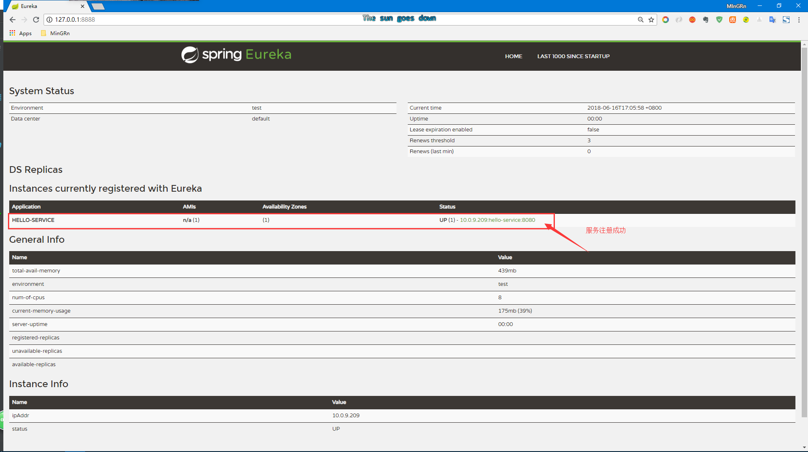

# spring-cloud-eureka-service 服务提供者

服务提供者与服务中心关联

* 配置文件
  - `server.port=8080`：设定服务端口，该端口不能与同一台机器上的服务中心端口冲突
  - `eureka.instance.hostname=localhost`：指定主机或者说指定注册中心主机
  - `spring.application.name=hello-service`：设定当前服务名称
  - `eureka.client.service-url.defaultZone=http://${eureka.instance.hostname}:8888/eureka`： 指向服务中心地址

* 启动类
  - 在启动类上加 `@EnableDiscoveryClient` 注解表示激活 `DiscoveryClient` 实现

----

在 `HelloWorldController` 中进行测试时注入 DiscoveryClient

```java
@Autowired
private DiscoveryClient discoveryClient;
```

看好多网上栗子在获取服务实例时都是直接调用方法：

```java
ServiceInstance instance = client.getLocalServiceInstance();
```

不过，这里在 DiscoveryClient 接口中没有找到该方法，原因是过时了。现在是直接提过如下几个方法：

```java
public interface DiscoveryClient {

	/**
	 * A human readable description of the implementation, used in HealthIndicator
	 * @return the description
	 */
	String description();

	/**
	 * Get all ServiceInstances associated with a particular serviceId
	 * @param serviceId the serviceId to query
	 * @return a List of ServiceInstance
	 */
	List<ServiceInstance> getInstances(String serviceId);

	/**
	 * @return all known service ids
	 */
	List<String> getServices();

}
```

主要有两个获取服务实例方法：
- `getInstances(String serviceId)` 获取指定服务实例
- `List<String> getServices()` 获取全部实例

**注意：** `serviceId` 指的是当前服务名称，就是在配置文件中定义的 `spring.application.name=hello-service`。

----

三种获取服务实例方式：

第一种：知道 serviceId

```java

    /**
     * 服务发现客户端
     */
    @Autowired
    private DiscoveryClient discoveryClient;

    @GetMapping("/index")
    public String index() {
    	ServiceInstance serviceInstance = serviceInstance();
    	LOGGER.info("provider service, host：{}，service_id：{}", serviceInstance.getHost(), serviceInstance.getServiceId());
    	return "provider service, host："+serviceInstance.getHost()+"，service_id："+serviceInstance.getServiceId();
    }

    private ServiceInstance serviceInstance() {
    	List<ServiceInstance> serviceInstanceList = discoveryClient.getInstances("hello-service");
    	return (serviceInstanceList != null && serviceInstanceList.size() > 0) ? serviceInstanceList.get(0) : null;
    }

```

第二种：不知道 serviceId，通过注入 `Registration` 获取

```java

    /**
     * 服务注册
     */
     @Autowired
     private Registration registration;

    /**
     * 服务发现客户端
     */
     @Autowired
     private DiscoveryClient discoveryClient;

     @GetMapping("/index")
     public String index() {
       	 ServiceInstance serviceInstance = serviceInstance();
       	 LOGGER.info("provider service, host：{}，service_id：{}", serviceInstance.getHost(), serviceInstance.getServiceId());
       	 return "provider service, host："+serviceInstance.getHost()+"，service_id："+serviceInstance.getServiceId();
     }

     private ServiceInstance serviceInstance() {
         List<ServiceInstance> serviceInstanceList = discoveryClient.getInstances(registration.getServiceId());
         return (serviceInstanceList != null && serviceInstanceList.size() > 0) ? serviceInstanceList.get(0) : null;
     }
```

第三种：直接获取全部服务实例

```java

   /**
    * 服务发现客户端
    */
    @Autowired
    private DiscoveryClient discoveryClient;

    @GetMapping("/index")
    public String index() {
	StringBuilder buf = new StringBuilder();
	List<String> serviceIds = discoveryClient.getServices();
	if(!CollectionUtils.isEmpty(serviceIds)){
		for(String s : serviceIds){
			System.out.println("serviceId:" + s);
			List<ServiceInstance> serviceInstances =  discoveryClient.getInstances(s);
			if(!CollectionUtils.isEmpty(serviceInstances)){
				for(ServiceInstance si:serviceInstances){
					buf.append("["+si.getServiceId() +" host=" +si.getHost()+" port="+si.getPort()+" uri="+si.getUri()+"]");
				}
			}else{
				buf.append("no service.");
			}
		}
	}
	return buf.toString();
    }
```

----

服务注册成功后会在注册中心看到该服务



也可以直接看服务注册中心控制台，控制台输出如下日志信息即表示服务注册成功

```
2018-06-17 12:57:14.916  INFO 5736 --- [nio-8888-exec-9] c.n.e.registry.AbstractInstanceRegistry  : Registered instance HELLO-SERVICE/10.0.9.209:hello-service:8080 with status UP (replication=false)
```

或者在服务提供者控制台中看到如下日志信息

```vim
2018-06-17 12:57:14.688  INFO 13104 --- [           main] o.s.c.n.e.s.EurekaServiceRegistry        : Registering application hello-service with eureka with status UP
2018-06-17 12:57:14.688  INFO 13104 --- [           main] com.netflix.discovery.DiscoveryClient    : Saw local status change event StatusChangeEvent [timestamp=1529211434688, current=UP, previous=STARTING]
2018-06-17 12:57:14.690  INFO 13104 --- [nfoReplicator-0] com.netflix.discovery.DiscoveryClient    : DiscoveryClient_HELLO-SERVICE/10.0.9.209:hello-service:8080: registering service...
2018-06-17 12:57:14.764  INFO 13104 --- [           main] o.s.b.w.embedded.tomcat.TomcatWebServer  : Tomcat started on port(s): 8080 (http) with context path ''
2018-06-17 12:57:14.765  INFO 13104 --- [           main] .s.c.n.e.s.EurekaAutoServiceRegistration : Updating port to 8080
2018-06-17 12:57:14.768  INFO 13104 --- [           main] c.m.s.s.SpringcloudServiceApplication    : Started SpringcloudServiceApplication in 7.92 seconds (JVM running for 8.594)
2018-06-17 12:57:14.918  INFO 13104 --- [nfoReplicator-0] com.netflix.discovery.DiscoveryClient    : DiscoveryClient_HELLO-SERVICE/10.0.9.209:hello-service:8080 - registration status: 204
```

现在访问服务 `hello-service` `127.0.0.1:8080/index` 就会在页面显示如下信息：

`provider service, host：localhost，service_id：HELLO-SERVICE`

----

参考：
- [springcloud(第三篇)springcloud eureka 服务注册与发现](https://blog.csdn.net/liaokailin/article/details/51314001)
- [SpringCloud之服务注册与发现](http://jianwl.com/2016/10/08/SpringCloud%E4%B9%8B%E6%9C%8D%E5%8A%A1%E6%B3%A8%E5%86%8C%E4%B8%8E%E5%8F%91%E7%8E%B0/)
- [Spring Cloud系列（二）：Eureka](http://www.imain.net/index.php/archives/55/)
- [Spring Cloud Eureka 入门 （二）服务提供者详解](https://blog.csdn.net/cnq2328/article/details/78331487)
