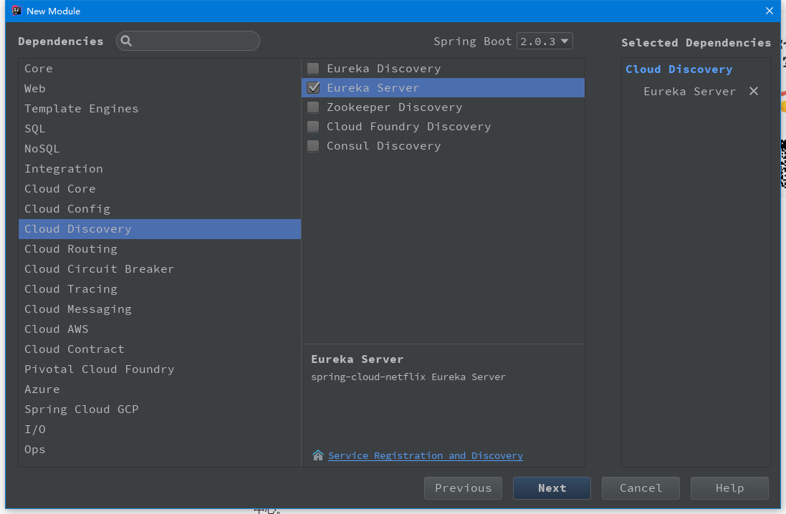

# spring-cloud-eureka 单节点服务注册中心

springcloud 工程创建与 springboot 工程创建一样，只不过在这个地方只需要勾选 `Cloud Discovery` 下的 `Eureka Serve` 即可。
如图：

**注意：** 工程创建完成后有时会发现 **启动类** 一直提示包无法引入！别急，重新 `mvn install` 一下或者换下 maven 配置文件重新引入一下就好了。

一切完成后还需要如下几步操作：

* 启动类
  + 在启动类上引入注解 `@EnableEurekaServer`： 表示启动一个服务注册中心提供给其他应用使用。
* 配置文件
  + `server.port=8888`：由于后续内容也都会在本地运行，为了与后续进行注册的服务区分，这里做好改变下
  + `eureka.instance.hostname=localhost`：设置当前实例的主机名称
  + `eureka.client.register-with-eureka=false`：是否需要注册到注册中心，由于该应用为注册中心,所以设置为false,代表不向注册中心注册自己
  + `eureka.client.fetch-registry=false`：由于注册中心的职责就是维护服务实例,它并不需要去检索服务,所以也设置为false
  + `eureka.client.service-url.defaultZone=http://${eureka.instance.hostname}:${server.port}/eureka`：注册服务器的地址：服务提供者和服务消费者都要依赖这个地址

----

接着来看下单节点服务提供者 [springcloud-eureka-service](../springcloud-eureka-service)

# 参考
  - [简书](https://www.jianshu.com/p/0aef3724e6bc)
  - [Spring Cloud Eureka 常用配置及说明](https://www.cnblogs.com/li3807/p/7282492.html)