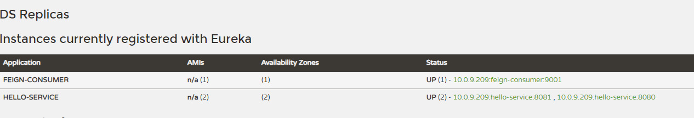
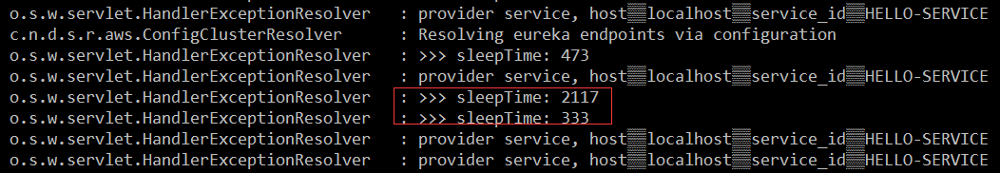

# springcloud-feign-consumer

在 服务发现于消费模块中介绍了([springcloud-ribbon-consumer](../springcloud-ribbon-consumer)) Ribbon 的使用。在使用 Ribbon 时通常会
利用 RestTemplate 的请求拦截来实现对依赖服务的接口调用。

而 RestTemplate 已经实现了对 HTTP 请求的封装处理，形成了一套模块化的调用方法。在服务发现于消费的栗子中简单介绍了 RestTemplate 调用的实现，在
实际开发中，由于对服务依赖的调用节能不要不止于一处，旺旺一个接口会被多次调用。所以通常都会针对各个服务自行封装一些客户端来保证这些依赖服务的调用，这
个时候会发现，由于 RestTemplate 的封装，几乎每个调用都是简单的模块化调用。

而 Spring Cloud Feign 在此基础上做了进一步的封装，有他来帮助我们定义和实现依赖接口的定义。在 Feign 的实现下，我们只需创建一个接口并用注解的方式
来配置它，即可实现对服务方的接口绑定，简化了在使用 Ribbon 时自行封装服务调用客户端的开发量。

----

* 创建一个 SpringBoot 工程，在pom中引入 eureka 和 feign springcloud依赖。

```xml
<dependency>
    <groupId>org.springframework.cloud</groupId>
    <artifactId>spring-cloud-starter-netflix-eureka-server</artifactId>
</dependency>
<dependency>
    <groupId>org.springframework.cloud</groupId>
    <artifactId>spring-cloud-starter-openfeign</artifactId>
</dependency>
```

在启动类上加入注解 `@EnableFeignClients` 用于开启 Spring Cloud Feign 功能。还要加上 `@EnableDiscoveryClient` 注解。

* 定义 HelloService 接口，通过 `@FeignClient` 注解指定服务名称来绑定服务，然后在通过 SpringMVC 的注解来绑定该服务提供的 REST 接口。

```java
@FeignClient("hello-service")
public interface HelloService {

	@GetMapping("/index")
	String index();

}
```

> **注意：** 这里服务名不区分大小写，所以 hello-service 和 HELLO-SERVICE 都是可以的。

* 创建 `ConsumerController` 来实现对 Feign 客户端的调用。使用 `@Autowired` 或 `Resource` 注解注入上面定义的 HelloService 实例，并在 helloConsumer 方法中发起 /index 接口的调用。

```java
@RestController
@RequestMapping
public class ConsumerController {

	@Resource
	private HelloService helloService;

	@GetMapping("feign-consumer")
	public String helloConsumer() {
		return helloService.index();
	}
}
```

* 最后，同 Ribbon 实现消费者一样，需要在 .properties 在中指定服务注册中心与自身服务名。

```
spring.application.name=feign-consumer
server.port=9001

eureka.instance.hostname=localhost

# 服务注册中心的地址
eureka.client.service-url.defaultZone=http://${eureka.instance.hostname}:8888/eureka
```

启动 单节点服务注册中心[springcloud-eureka](../springcloud-eureka) 两个单节点服务提供者[springcloud-eureka-service](../springcloud-eureka-service) 然后启动该应用。



发送几次 GET 请求 `http://localhost:9001/feign-consumer` 可以得到如之前 Ribbon 实现时一样的效果，正确返回如下信息：

```
provider service, host：localhost，service_id：HELLO-SERVICE
```

----

**进阶篇：参数绑定**

在前面的示例中，使用 Feign 实现的是一个不带参数的 REST 服务绑定。然而在实际应用中各种业务接口要比它复杂的多，这里笔者会在 HTTP 的各个位置传入各种不同类型的参数与响应值。

在单节点服务提供者[springcloud-eureka-service](../springcloud-eureka-service)中新增接口。包含带 Request 参数的请求、带有 Header 信息的请求、带有 RequestBody 的请求以及请求相应提中是一个对象的请求。

```java
@RestController
@RequestMapping
public class HelloWorldController {

	@GetMapping("/hello1")
	public String hello1(@RequestParam String name) {
		return "Hello" + name;
	}

	@GetMapping("/hello2")
	public User hello2(@RequestHeader String name, @RequestHeader Integer age) {
		return new User(name, age);
	}

	@PostMapping("/hello3")
	public String hello3(@RequestBody User user) {
		StringBuffer sb = new StringBuffer("Hello")
				.append(user.getName())
				.append(",")
				.append(user.getAge());
		return sb.toString();
	}
}
```

User 对象

```java
public class User {

	private String name;

	private Integer age;

	public User(){

	}

	public User(String name, Integer age) {
		this.name = name;
		this.age = age;
	}

      //get set...

	@Override
	public String toString() {
		return "name=" + name + ",age=" + age;
	}
}
```

改造完成后回到该工程中实现这些新增的请求绑定。

- 在该工程中创建与上面一样的 User 类。
- 在 HelloService 中新增对上述三个新增接口的绑定声明，修改后接口内容如下所示：

```java
@FeignClient("hello-service")
public interface HelloService {

	@GetMapping("/index")
	String index();

	@GetMapping("/hello1")
	String hello1(@RequestParam("name") String name);

	@GetMapping("/hello2")
	User hello2(@RequestHeader("name") String name, @RequestHeader("age") Integer age);

	@PostMapping("/hello3")
	String hello3(@RequestBody User user);
}
```

>**注意：** 在这个接口中定义各种参数绑定时，`@RequestParam`、`@RequestHeader` 等可以指定参数名称的注解，它们的 Value 千万不能少！在 Spring MVC 应用中，这些注解会根据参数名来作为默认值，但是在 Feign 中绑定参数必须通过 Value 属性来知名具体的参数名，不然会抛出 `IllegalStateException` 异常。

- 在 ConsumerController 中新增一个 /feign-consumer2 接口 来对上面声明的接口进行调用，内容如下：

```java
@RestController
@RequestMapping
public class ConsumerController {

	@Resource
	private HelloService helloService;

	@GetMapping("feign-consumer")
	public String helloConsumer() {
		return helloService.index();
	}

	@GetMapping("feign-consumer2")
	public String helloConsumer2() {
		StringBuilder sb = new StringBuilder();
		sb.append(helloService.index()).append("\n")
				.append(helloService.hello1("MinGRn")).append("\n")
				.append(helloService.hello2("MinGRn", 18)).append("\n")
				.append(helloService.hello3(new User("MinGRn", 18))).append("\n");
		return sb.toString();
	}
}
```

启动服务注册中心、两个服务提供者与该工程。请求 URL `http://localhost:9001/feign-consumer2` 会得到如下输出：

```
provider service, host：localhost，service_id：HELLO-SERVICE HelloMinGRn name=MinGRn,age=18 HelloMinGRn,18
```

----

**终极篇：继承特性**

在 **进阶篇** 中介绍了各种参数的绑定中会注意到，当使用 Spring MVC 的注解绑定服务接口时，几乎完全可以从服务提供方的 Controller 中 Ctrl +c/v 构建相应的客户端绑定接口。既然存在这么多服务操作这部分是不是可以考虑进一步抽象呢？在 Feign 中，针对该问题提供了集成特性帮助我们接口这一问题。

- 为了能够服务 Model 下的 User 和 interface 下的 HelloService 我们可以创建一个基础的 SpringBoot 工程，比如命名为 hello-service-api。
- 由于在 hello-service-api 中需要定义同时可服务的服务端与客户端接口，需要使用到 Spring MVC 注解，所以需要在 pom.xml 中引入 `spring-boot-starter-web` 依赖。
- 将 User 对象 Ctrl+v hello-service-api 工程中，包路径为 `com.mingrn.model.User`
- 在 hello-service-api 工程中创建 HelloService 接口，包路径为 `com.mingrn.service.HelloService`。内容如下：

```java
@RequestMapping("/refactor")
public interface HelloService {

	@GetMapping("/hello4")
	String hello1(@RequestParam("name") String name);

	@GetMapping("/hello5")
	User hello2(@RequestHeader("name") String name, @RequestHeader("age") Integer age);

    //User => com.mingrn.model.User
	@PostMapping("/hello6")
	String hello3(@RequestBody User user);
}
```

> 因为后续还会在之前的服务提供者 hello-service 与 服务提供与消费 feign-consumer 中重构，多以为了混滑稽这里改了接口名，并且在头部定义了 /refactor 前缀！

- 下面在  hello-service 中进行重构，在 pom 中引入该依赖

```xml
<dependency>
    <groupId>com.mingrn</groupId>
    <artifactId>hello-service-api</artifactId>
    <version>0.0.1-SNAPSHOT</version>
</dependency>
```

- 创建 RefactorHelloController 类实现 hello-service-api 中定义的 HelloService 接口，内容如下：

```java
@RestController
public class RefactorHelloController implements com.mingrn.service.HelloService{

	@Override
	public String hello1(@RequestParam String name) {
		return "Hello" + name;
	}

	@Override
	public User hello2(@RequestHeader String name, @RequestHeader Integer age) {
		return new User(name, age);
	}

	@Override
	public String hello3(@RequestBody User user) {
		StringBuffer sb = new StringBuffer("Hello")
				.append(user.getName())
				.append(",")
				.append(user.getAge());
		return sb.toString();
	}
}
```

我们可以看到通过实现方式，在 Controller 中不在包含以往定义的请求路径注解 `@RequestMapping`，而参数的注解定义在重写的时候自动带过来。在这个类中除了要实现接口逻辑外只需要增加 `@RestController` 注解使该类成为 REST 接口类就大功告成了！

- 完成服务提供者重构后，接下来需要在消费者 `feign-consumer` 的 pom 文件中如之前服务提供者引入对 hello-service-api 的依赖。
- 创建 RefactorHelloService 接口，并继承 hello-service-api 中定义的 HelloService 接口，然后添加 `@FeignClient` 注解来绑定服务

```java
@FeignClient("hello-service")
public interface RefactorHelloService extends com.mingrn.service.HelloService{

}
```

- 最后，在 ConsumerController 中注入 RefactorHelloService 的示例，并新增 `/feign-consumer3` 接口，内容与 `/feign-consumer2` 一样。进行测试会发现与之前一样的效果。

----

**Ribbon配置**

由于 Feign 的客户端负载均衡是通过 Ribbon 实现的，所以我们可以直接通过配置 Ribbon 客户端的方式来自定义各个服务客户端掉还用的参数！

在 Ribbon 中<u>全局配置</u>通过 ribbon.Key=value 的方式来设置各项啊参数，比如默认的客户端超时时间：

```
ribbon.ConnectTimeout=500
ribbon.ReadTimeout=5000
```

在大多数情况下，对于服务的调用超时时间会根据实际服务的特性做些调整。直接使用全局配置肯定不行的。在使用 Feign 的时候，针对各个服务客户端进行个性化配置的方式与 Ribbon 配置方式一样的，都采用 client-name.ribbon.key=value 的格式进行设置。那么 client-name
所指代的 Ribbon 客户端在哪里？

在之前定义 Feign 客户端的时候，我们采用 `@FeignClinet` 注解。在初始化过程中， Feign 会根据注解的 name 属性或 value 实行指定的服务名自动创建一个同名的 Ribbon 客户端。也就是说，在之前的示例中，使用 `@FeignClient("hello-service")` 来创建 Feign 客户端的时候，同时创建了一个名为 HELLO-SERVICE 的Ribbon 客户端。既然如此，我们就可以使用该注解中的name或value属性来设置对应的 Ribbon 参数，如：

```
# 建立连接超时时间
hello-service.ribbon.ConnectTimeout=200
# 服务器求情超时时间
hello-service.ribbon.ReadTimeout=2000
# 所有操作都开启重试机制
hello-service.ribbon.OkToRetryOnAllOperations=true
# 单节点重试最大次数
hello-service.ribbon.MaxAutoRetrys=1
# 重试发送，更换节点最大值
hello-service.ribbon.MaxAutoRetriesNextServer=2
```

现在，我们来进行测试重试机制，之前我们已经在 服务提供者[springcloud-eureka-service](../springcloud-eureka-service) 中定义了一个接口 `/serviceBlock` 用来模拟服务阻塞。那这里就直接利用该接口！

在 HelloService 接口类中新增 接口：

```java
@GetMapping("/serviceBlock")
String serviceBlock();
```

在 ConsumerController 中新增方法：

```java
@GetMapping("serviceBlock")
public String serviceBlock() {
	return helloService.serviceBlock();
}
```

启动服务注册中心、两个服务提供者、与该工程，访问 URL `http://localhost:9001/serviceBlock`。会输出如下内容(由于SleepTime 随机性，并不是每次都相同)：



从这个信息可以看出，由于超时时候为 2000 毫秒，当等待时间超过这个时间时就会发起重试，第二次请求时间小于 2000 毫秒。虽然经历了一次失败，但是通过重试机制最终还是获得请求的结果！

----

**Hystrix 配置**

之前介绍了 Ribbon 的配置，需要注意的一天就是 Ribbon 的超时与 Hystrix 的超时是两个概念。我们需要让 Hystrix 的超时时间大于 Ribbon 的超时时间，否则 Hystrix 超时后该命令直接熔断，Ribbon 的重试机制就没有了意义！

在 Feign 中除了引用了用于客户端的负载均衡 Ribbon 外 还引用了服务保护与熔断的工具 Hystrix。默认情况下， Feign 会将所有 Feign 客户端的方法否封装到 Hystrix 命令中进行服务保护。这里就说下在 Feign 中 Hystrix 如何配置服务降级。

对于 Hystrix 的全局配置同 Spring Cloud Ribbon 的全局配置一样，直接采用它的默认配置前缀 `hystrix.command.default` 就可以进行设置，比如设置全局超时时间：

```
hystrix.command.default.execution.isolation.thread.timeoutInMilliseconds=5000
```

另外，在对 Hystrix 进行配置之前，我们需要确认 `feign.hystrix.enable` 参数没有被设置为 false，否则该参数设置会关闭 Feign 客户端的 Hystrix 支持。而对于我们之前测试重试机制时，对于 Hystrix 的超时时间控制除了可以使用上面的配置来增加熔断超时时间，也可以通过 `feign.hystrix.enable=false` 来关闭 Hystrix 功能，或者使用 `hystrixw.command.default.execution.timeout.enable = false` 来关闭熔断功能。

另外，如果不想关闭 Hystrix 的全局支持，而只想针对某个服务客户端关闭 Hystrix 支持时，需要通过使用 `@Scope("prototype")` 注解为指定的客户端配置 `Feign.builder` 实例，如下所示：

```java
@Configuration
public class DisableHystrixConfiguration {

	@Bean
	@Scope("prototype")
	public Feign.Builder feignBuilder() {
		return new Feign.Builder();
	}
}

@FeignClient(value = "hello-service", configuration = DisableHystrixConfiguration.class)
public interface HelloService {

	@GetMapping("/serviceBlock")
	String serviceBlock();

	@GetMapping("/index")
	String index();

	@GetMapping("/hello1")
	String hello1(@RequestParam("name") String name);

	@GetMapping("/hello2")
	User hello2(@RequestHeader("name") String name, @RequestHeader("age") Integer age);

	@PostMapping("/hello3")
	String hello3(@RequestBody User user);
}
```

通过声明一个配置类，在HelloService 接口中通过 configuration  配置属性中引入即可。

关于服务降级配置，声明一个类 `HelloServiceFallback` 实现 `HelloService` 接口，重写方法，在重写的方法中处理。需要在实现类中增加 `@Component` 注解。再在 HelloService 类中通过 fallback 调用即可，如下：

```java
@Component
public class HelloServiceFallback implements HelloService {
	@Override
	public String serviceBlock() {
		return "error";
	}

	@Override
	public String index() {
		return "error";
	}

	@Override
	public String hello1(String name) {
		return "error";
	}

	@Override
	public User hello2(String name, Integer age) {
		return new User("未知", 0);
	}

	@Override
	public String hello3(User user) {
		return "error";
	}
}


@FeignClient(value = "hello-service", fallback = HelloServiceFallback.class,configuration = DisableHystrixConfiguration.class)
public interface HelloService {

	@GetMapping("/serviceBlock")
	String serviceBlock();

	@GetMapping("/index")
	String index();

	@GetMapping("/hello1")
	String hello1(@RequestParam("name") String name);

	@GetMapping("/hello2")
	User hello2(@RequestHeader("name") String name, @RequestHeader("age") Integer age);

	@PostMapping("/hello3")
	String hello3(@RequestBody User user);
}
```
