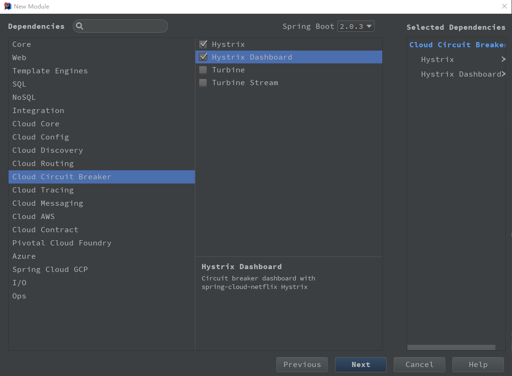
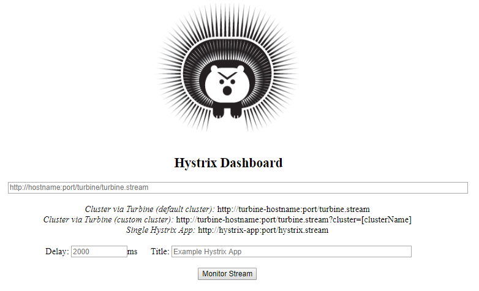
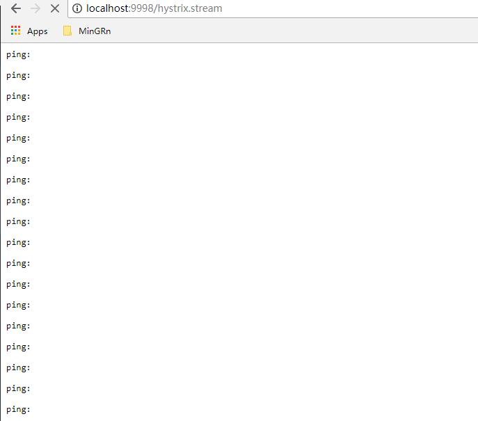
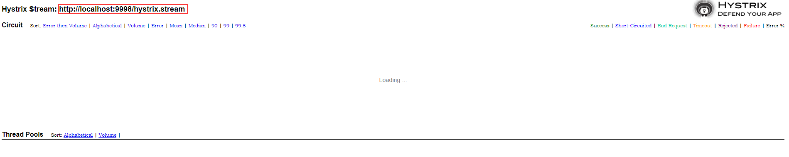
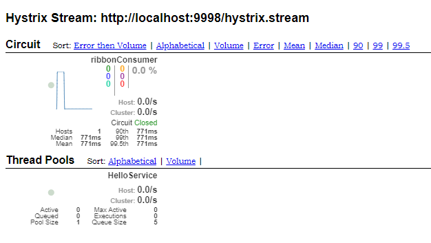

# Hystrix Dashboard 仪表盘

Hystrix Dashboard 是请求命令的度量指标监控。这些度量指标指的是 HystrixCommand 和
HystrixObservableCommand 实例在执行过程中记录的重要信息。

除了在 Hystrix 断路由实现中使用之外，对于系统运维也非常有用。

这些指标信息会以 “滚动时间窗” 与 “桶” 结合的方式进行汇总，并在内容中驻留一点时间，以
供内内部或外部进行查询使用，Hystrix 仪表盘就是这些指标内容的消费者之一。

----

# Hystrix Dashboard 工程构建

类似于之前一样，在构建speingboot项目步骤时只需要勾选 `Hystrix` 和 `Hystrix Dashboard`
即可，如图：



或者直接引入SpringCloud依赖：

```xml
<dependency>
		<groupId>org.springframework.cloud</groupId>
		<artifactId>spring-cloud-starter-netflix-hystrix</artifactId>
</dependency>
<dependency>
		<groupId>org.springframework.cloud</groupId>
		<artifactId>spring-cloud-starter-netflix-hystrix-dashboard</artifactId>
</dependency>
```

另外还要引入监控与管理依赖依赖：

```xml
<dependency>
		<groupId>org.springframework.boot</groupId>
		<artifactId>spring-boot-starter-actuator</artifactId>
</dependency>
```

构建完成后再启动类上加入 `@EnableHystrixDashboard`  注解用于开启 Hystrix Dashboard
仪表盘功能。

配置文件如下：

```profile
# 端口任意，只要不冲突即可
server.port=2001
spring.application.name=hystrix-dashboard
```

启动工程并访问：`http://127.0.0.1:2001/hystrix` 看到如下页面即表示成功：



在该监控首页主要有如下信息：

* `Delay`：该参数用来控制服务器上轮询监控信息的延迟时间，默认 2000 毫秒，可以通过配
置该属性来降低客户端网络和CPU消耗。

* `Title`：该参数主要对应监控标题。

* `三种监控方式：`
  - 默认的集群监控：通过 URL `http://turbine-hostname:port/turbine.stream ` 开启，实现默认集群的监控。
  - 指定的集群监控：通过URL `http://turbine-hostname:port/turbine.stream?cluster=[clusterName] `开启，实现对 clusterName 集群的监控。
  - 单体应用的监控：通过URL `http://hystrix-app:port/hystrix.stream ` 开启，实现对具体某个服务实例的监控。

>**说明：** 前两者都是对集群的监控，需要整合 Turbine才能实现。

----

# 单体服务实例的监控实现

在实现单体服务实例监控之前需要先启动：

* 单节点服务注册中心：[springcloud-eureka](../springcloud-eureka)
* 单节点服务提供者：[springcloud-eureka-service](../springcloud-eureka-service)
* 断路由服务消费者：[springcloud-ribbon-hystrix-consumer](../springcloud-ribbon-hystrix-consumer)

>**说明：** 单节点服务提供者需要启动两个实例，如端口分别是：8081、8082。

在服务注册中心能看到两个服务提供者与断路由服务消费者后，先测试断路由服务消费者监控是否能用。
如这里启动的端口是9998，就访问：`http://localhost:9998/hystrix.stream` 看页面是否一直打印 `ping:`，
页面如下：



>说明：在没有访问任何服务时ping是没有任何信息的。

如果访问失败者说明没有 `/hystrix.stream` 端点。在断路由服务消费者 pom 文件中 `actuator` 依赖是否
成功引入，如果成功引入后依然无法访问该端点，需要新增如下配置信息：

```java
package com.mingrn.hystrix.config;

import com.netflix.hystrix.contrib.javanica.aop.aspectj.HystrixCommandAspect;
import com.netflix.hystrix.contrib.metrics.eventstream.HystrixMetricsStreamServlet;
import org.springframework.boot.web.servlet.ServletRegistrationBean;
import org.springframework.context.annotation.Bean;
import org.springframework.context.annotation.Configuration;

/**
 * Hystrix 配置
 *
 * @author MinGRn <br > 2018/6/30 17:02
 */
@Configuration
public class HystrixConfig {

	/**
	 * 用来拦截处理HystrixCommand注解
	 */
	@Bean
	public HystrixCommandAspect hystrixCommandAspect() {
		return new HystrixCommandAspect();
	}


	/**
	 * 用来像监控中心Dashboard发送stream信息
	 */
	@Bean
	public ServletRegistrationBean servletRegistrationBean() {
		ServletRegistrationBean registration = new ServletRegistrationBean(new HystrixMetricsStreamServlet());
		registration.addUrlMappings("/hystrix.stream");
		return registration;
	}

}
```

重启服务，再次访问！

一切完成后，在监控仪表盘中输入 URL `http://localhost:9998/hystrix.stream` 点击 **Monitor stream** 就能成功
进入服务实例的监控台。页面如下：



这里一直提示 `Loading` 原因是没有访问任何服务，当访问服务时如：`http://localhost:9998/ribbon-consumer`
在监控台中就会有监控信息，如下：



在上一张截图中，有部分用红色框进行了标注，之前有说 Title 配置属性时指的就是这里！

到目前为止单体服务监控就完成了，接下来就是集群监控了！

----

# Turbine 集群监控实现

在说Turbine 集群监控实现之前要先看下 [springcloud-turbine](../springcloud-turbine) 工程！

然后与单体服务监控一样，启动服务：

* 单节点服务注册中心：[springcloud-eureka](../springcloud-eureka)
* 单节点服务提供者：[springcloud-eureka-service](../springcloud-eureka-service)
* 断路由服务消费者：[springcloud-ribbon-hystrix-consumer](../springcloud-ribbon-hystrix-consumer)

这里不同的是，因为要测试集群，所以断路由服务消费也需要启动两个服务实例。

启动成功后会在注册中心看到两个服务提供者、两个服务消费者实例！

接着启动 [springcloud-turbine](../springcloud-turbine) 集群监控 实例，刷新注册中心，后看到该实例后
访问 Hystrix Dashboard，并开启对 ``http://localhost:8989/turbine.stream` 的监控，能看到与单体服务监控类似的页面。
