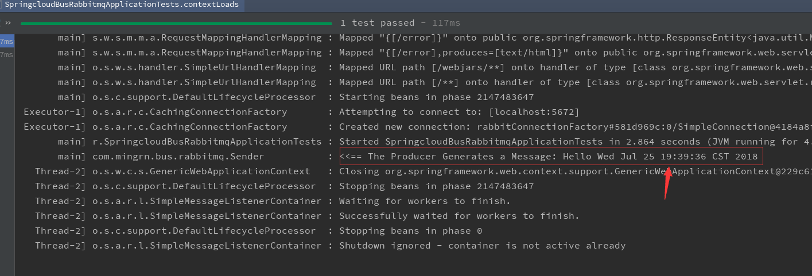
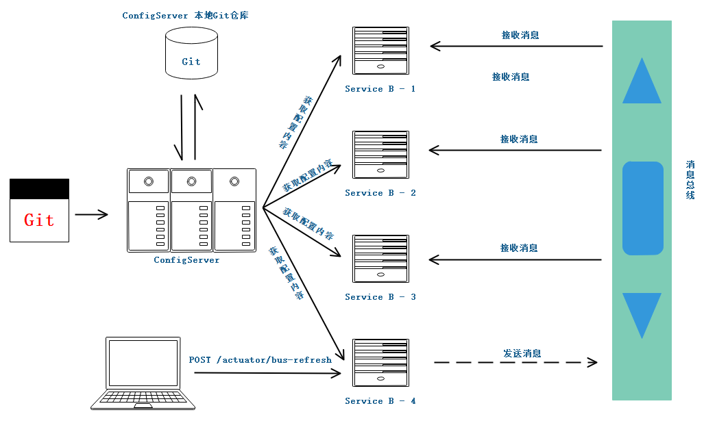
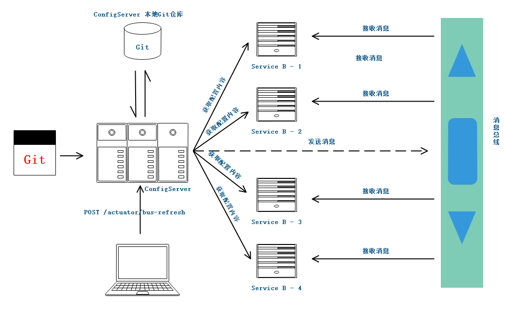

# RabbitMQ 实现消息总线

在介绍基本概念之前直接先在主机上安装一下 RabbitMQ。

rabbitMQ 是一个在AMQP协议标准基础上完整的，可服用的企业消息系统。它遵循Mozilla Public License开源协议，采用 Erlang 实现的工业级的消息队列(MQ)服务器，Rabbit MQ 是建立在 Erlang OTP平台上。所以，在安装 RabbitMQ 之前先装 ERL 环境。

访问 [Erlang官网](http://www.erlang.org) 在下载页面选择适合自己操作系统的安装文件。


下载后直接安装，并在环境变量中配置变量。环境变量要指到 bin 目录，配置好后再命令行中输入 `erl -version`，能输出版本号即 Erl 环境已经配置完成。


在进入 RabbitMQ官网 下载 MQ，找到对应的系统环境直接下载安装 next、next and next......


安装完成后，就能在服务中看到 rabbitMQ 服务


接着进入 rabbitMQ 安装目录下的 `sbin` 文件夹，打开控制台执行 `rabbitmqctl status` 查看参数信息


一切正常后就开启 web 管理后台，在命令行中继续输入 `rabbitmq-plugins enable rabbitmq_management` 命令


重启服务，访问 `http://localhost:15672` 就能看到管理后台，默认账号密码为 `guest`。

现在试着在用户管理中新建一个用户：


rabbitMQ 的安装到此结束

---

创建工程，并在 pom 依赖中引入 `spring-boot-starter-amqp` 依赖

```xml
<dependency>
    <groupId>org.springframework.boot</groupId>
    <artifactId>spring-boot-starter-amqp</artifactId>
</dependency>
<dependency>
    <groupId>org.springframework.boot</groupId>
    <artifactId>spring-boot-starter-web</artifactId>
</dependency>
<dependency>
    <groupId>org.springframework.boot</groupId>
    <artifactId>spring-boot-starter-test</artifactId>
    <scope>test</scope>
</dependency>
```

配置文件内容如下：

```properties
spring.application.name=rabbitmq-hello

spring.rabbitmq.host=localhost
spring.rabbitmq.username=springcloud
spring.rabbitmq.password=123456
spring.rabbitmq.port=5672
```

- `spring.rabbitmq.host`：rabbitMQ 主机地址
- `spring.rabbitmq.username`：rabbitMQ 账号
- `spring.rabbitmq.password`：rabbitMQ 密码
- `spring.rabbitmq.port`：rabbitMQ 端口

启动类不需要做任何改变。创建一个消息生成这类 `Sender`

```java
@Component
public class Sender {

	private static final Logger LOGGER = LoggerFactory.getLogger(Sender.class);

	@Resource
	private AmqpTemplate amqpTemplate;

	public void send() {
		String context = "Hello " + new Date();
		LOGGER.info("<<== The Producer Generates a Message: {}", context);
		amqpTemplate.convertAndSend("hello", context);
	}
}
```

在消息生成这类中注入 `AmqpTemplate` 接口来实现消息的发送。在生成者中，我们产生一个字符串，并发送至 hello 的队列中。

接着创建消费者类 `Receiver`

```java
@Component
@RabbitListener(queues = "hello")
public class Receiver {

	private static final Logger LOGGER = LoggerFactory.getLogger(Receiver.class);

	@RabbitHandler
	public void process(String context) {
		LOGGER.info("Receiver: {}", context);
	}
}
```

在消费者类上加上 `@RabbitListener` 注解并制定消息队列，在消费体中使用 `@RabbitHandler` 注解来指定对消息的处理方法。所以，该消费者实现了对 hello 队列的消费。

再创建 `RabbitConfig` 配置类，用来配置队列、交换器、路由等信息。

```java
@Configuration
public class RabbitConfig {

	@Bean
	public Queue helloQueue() {
		return new Queue("hello");
	}
}
```

最后再创建测试单元，用来调用消息生产者。

```java

@RunWith(SpringRunner.class)
@SpringBootTest
public class SpringcloudBusRabbitmqApplicationTests {

	@Resource
	private Sender sender;

	@Test
	public void contextLoads() {
		sender.send();
	}

}
```

完成准备工作之后，就来启动应用主类。在启动时发现包错，错误信息如下：


原因是在配置文件中配置的用户没有分配权限，在刚才创建的 `springcloud` 账号除了创建外没有分配任何权限，可以看到信息面板：


只需要给该用户分配权限即可！


现在再来重启服务，会看到 rabbitMQ 的连接信息：


运行测试类，从控制台打印的日志中可以看到生成了一条数据：



再来看下应用主类控制台，成功的消费了这条消息！


---

在前面展示了 rabbitMQ 消息总线的 生产者与消费者的一个简单小应用。

rabbitMQ 是实现了高级消息队列协议的开源消息代理软件，也称为面向消息的中间件。rabbitMQ 是用高可用、可伸缩而闻名的 Erlang 语言编写而成的，其集群和故障转移是构建在开放电信平台框架上的。

**rabbitMQ 的基本概念** ：

- `Broker`：消息队列服务器的实体。是一个中间件应用，负责接收生产者的消息，然后将消息发送至消费者或其他的 Broker。
- `Exchange`：消息交换机。是消息第一个到达的地方，消息通过它指定的路由规则分发到不同的消息队列中去。
- `Queue`：消息队列。消息通过发送和路由之后最终到达的地方。到达 Queue 的消息即进入逻辑上等待消费的状态。每个消息都会被发送到一个或多个队列。
- `Binding`：绑定。它的作用就是将 Exchange 和 Queue 安装路由规则绑定起来，也就是两者之间的虚拟连接。
- `Routing Key`：路由关键字。Exchange 根据这个关键字进行消息投递。
- `Virtual host`：虚拟主机。是对 Broker 的虚拟划分，将消费者、生产者和他们的依赖的 AMQP 相关结构进行隔离，一般是为了安全考虑。比如：可以在一个 Broker 中设置多个虚拟主机，对不同用户进行权限的分离。
- `Connection`：连接。代表生产者、消费者、Broker之间进行通信的物理网络。
- `Channel`：消息通道。用于连接生产者、消费者的逻辑结构。在客户端的每一个连接里可建立多个 Channel，每个 Channel 代表一个会话任务，通过 Channel 可以隔离同一连接中的不同交互内容。
- `Producer`：消息生产者。
- `Consumer`：消息消费者。

**消息投递到队列大致过程** ：

1. 客户端连接带消息队列服务器，打开一个 Channel。
2. 客户端生成一个 Exchange，并设置相关属性。
3. 客户端声明一个 Queue，并设置相关属性。
4. 客户端使用 Routing Key，在 Exchange 和 Queue 之间建立好绑定关系。
5. 客户端投递消息到 Exchange。
6. Exchange 接收到消息后，根据消息的 Key 和已经谁知的 Binding 进行消息路由。将消息投递到一个或多个 Queue 里。
   - Direct 交换机：完全根据 Key 进行投递。比如：绑定时设置了 Routing Key 为 abc，那么客户端提交的信息，只有设置了 Key 为 abe 的才会被投递到队列。
   - Topic 交换机：对 Key 进行模糊匹配后进行投递，可以使用符号 `#` 匹配一个或多个词，符号 `*` 匹配正好有个词。比如 `abc.#` 匹配 `abc.def.ghi`， `abc.*` 只匹配 `abc.def`。
   - Fanout 交换机：不需要设置 Key，它采用广播的模式，一个消息进来时被投递到与该交换机绑定的所有队列。
   
---

在前面的的工程中有介绍 SpringCloud Config 的动态更新。我们在远程仓库的配置中心中配置信息，当配置中心的配置信息更新时我们需要调用 `/actuator/refresh` POST 端点去更新各个客户端的配置。那这里就来看下如何通过 RabbitMQ 的消息总线去更新一个服务的各个实例的配置信息！

这里不需要创建任何工程，只需要将 [服务注册中心](../springcloud-eureka) 启动起来，然后将 [springcloud-config-client-eureka](../springcloud-config-client-eureka) 和 [springcloud-config-server-eureka](../springcloud-config-server-eureka) 工程各拷贝一份，分别命名为 [springcloud-config-client-eureka-bus](../springcloud-config-client-eureka-bus)(Config Eureka Client) 和 [springcloud-config-server-eureka-bus](../springcloud-config-server-eureka-bus)(Config Eureka Server)。

在这两个工程中分别引入 `spring-cloud-starter-bus-amqp` 和 `spring-boot-starter-actuator` 依赖

```xml
<dependency>
    <groupId>org.springframework.cloud</groupId>
    <artifactId>spring-cloud-starter-bus-amqp</artifactId>
</dependency>
<dependency>
    <groupId>org.springframework.boot</groupId>
    <artifactId>spring-boot-starter-actuator</artifactId>
</dependency>
```

> **注意：** spring-boot-starter-actuator 依赖也是必须的，用于提供刷新端点。

在 Config Server 的配置文件中在之前的基础上增加如下配置信息：

```properties
#暴露所有端点
management.endpoints.web.exposure.include=*
## RabbitMQ
spring.rabbitmq.port=5672
spring.rabbitmq.host=localhost
spring.rabbitmq.username=springcloud
spring.rabbitmq.password=123456
```

而在 Config Client 中的配置文件中只需要增加 `management.endpoints.web.exposure.include=*` 配置即可！

现在启动 [springcloud-config-server-eureka-bus](../springcloud-config-server-eureka-bus)(7001) 和 [springcloud-config-client-eureka-bus](../springcloud-config-client-eureka-bus)。其中 springcloud-config-client-eureka-bus 启动不同端口的两个实例，如(7002,7003)。

在注册中心中看到三个服务如下三个服务：


现在通过工具或浏览器访问 `http://localhost:7001/actuator`，会看到 Config Server 暴露的端点如下：

```json
{
    "_links": {
        "self": {
            "href": "http://localhost:7001/actuator",
            "templated": false
        },
        "archaius": {
            "href": "http://localhost:7001/actuator/archaius",
            "templated": false
        },
        "auditevents": {
            "href": "http://localhost:7001/actuator/auditevents",
            "templated": false
        },
        "beans": {
            "href": "http://localhost:7001/actuator/beans",
            "templated": false
        },
        "health": {
            "href": "http://localhost:7001/actuator/health",
            "templated": false
        },
        "conditions": {
            "href": "http://localhost:7001/actuator/conditions",
            "templated": false
        },
        "configprops": {
            "href": "http://localhost:7001/actuator/configprops",
            "templated": false
        },
        "env": {
            "href": "http://localhost:7001/actuator/env",
            "templated": false
        },
        "env-toMatch": {
            "href": "http://localhost:7001/actuator/env/{toMatch}",
            "templated": true
        },
        "info": {
            "href": "http://localhost:7001/actuator/info",
            "templated": false
        },
        "loggers": {
            "href": "http://localhost:7001/actuator/loggers",
            "templated": false
        },
        "loggers-name": {
            "href": "http://localhost:7001/actuator/loggers/{name}",
            "templated": true
        },
        "heapdump": {
            "href": "http://localhost:7001/actuator/heapdump",
            "templated": false
        },
        "threaddump": {
            "href": "http://localhost:7001/actuator/threaddump",
            "templated": false
        },
        "metrics-requiredMetricName": {
            "href": "http://localhost:7001/actuator/metrics/{requiredMetricName}",
            "templated": true
        },
        "metrics": {
            "href": "http://localhost:7001/actuator/metrics",
            "templated": false
        },
        "scheduledtasks": {
            "href": "http://localhost:7001/actuator/scheduledtasks",
            "templated": false
        },
        "httptrace": {
            "href": "http://localhost:7001/actuator/httptrace",
            "templated": false
        },
        "mappings": {
            "href": "http://localhost:7001/actuator/mappings",
            "templated": false
        },
        "refresh": {
            "href": "http://localhost:7001/actuator/refresh",
            "templated": false
        },
        "bus-env-destination": {
            "href": "http://localhost:7001/actuator/bus-env/{destination}",
            "templated": true
        },
        "bus-env": {
            "href": "http://localhost:7001/actuator/bus-env",
            "templated": false
        },
        "bus-refresh-destination": {
            "href": "http://localhost:7001/actuator/bus-refresh/{destination}",
            "templated": true
        },
        "bus-refresh": {
            "href": "http://localhost:7001/actuator/bus-refresh",
            "templated": false
        },
        "features": {
            "href": "http://localhost:7001/actuator/features",
            "templated": false
        },
        "service-registry": {
            "href": "http://localhost:7001/actuator/service-registry",
            "templated": false
        },
        "bindings-name": {
            "href": "http://localhost:7001/actuator/bindings/{name}",
            "templated": true
        },
        "bindings": {
            "href": "http://localhost:7001/actuator/bindings",
            "templated": false
        },
        "channels": {
            "href": "http://localhost:7001/actuator/channels",
            "templated": false
        }
    }
}
```

这里主要使用 `bus-refresh` 和 `bus-refresh-destination` 端点用于刷新配置，这两个端点都是 POST请求。

现在分别访问 `http://localhost:7002/from` 和 `http://localhost:7003/from`，会看到成功返回配置文件中的 from 属性值：`git-dev-1.0`。

现在，修改配置中心 from 属性值为 `git-dev-2.0`，并请求 `http://localhost:7001/actuator/refresh` 或 `http://localhost:7002/actuator/refresh` 或 `http://localhost:7003/actuator/refresh`。在此请求两个客户端信息就会发现两个客户端返回的数据是 `git-dev-2.0`。成功刷新配置信息！

> **注意：** 请求 Server 端点的 `/actuator/refresh` 是刷新所有客户端的配置信息，而请求 Client 端点的 `/actuator/refresh` 则是刷新这个实例服务的所有实例配置信息。而，如果只想刷新某个服务的具体实例，比如：Config：7002 实例，则只需要请求 `http://localhost:7001/actuator/bus-refresh/config:7002` 即可！

只看代码可有有点不好理解，现在来看下图示：

Config Client 请求消息总线：


Config Server 请求消息总线：
