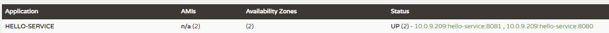
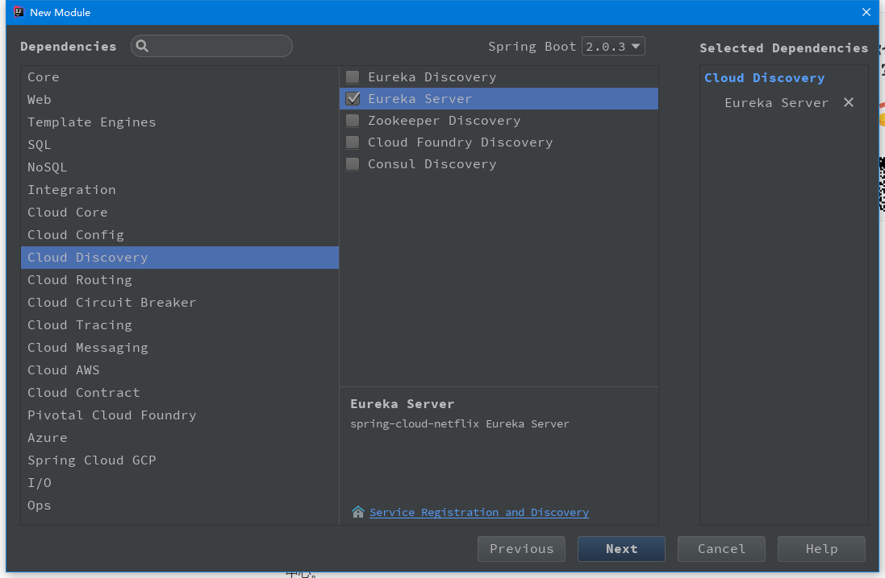
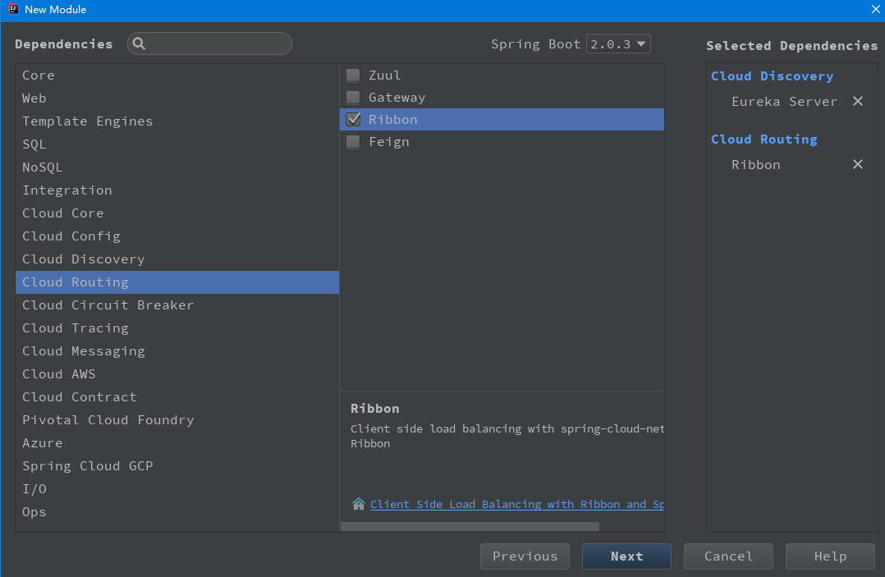
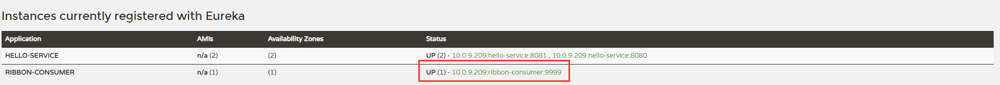

# 服务发现与消费

在前面已经介绍了微服务架构的核心组件 一一 服务注册中心：

* [单节点模式](../springcloud-eureka)
* [高可用（多节点）模式](../springcloud-eureka-peer)

并实现了两个简单的程序注册到 Eureka 注册中心上，成为服务治理体系下的一个服务

* [单节点模式服务](../springcloud-eureka-service) 命名 为：hello-service
* [高可用（多节点）模式服务](../springcloud-eureka-peer-service) 命名为：HELLO-SERVICE

现在我们已经有个服务注册中心与服务提供者，现在就来尝试构建一个服务消费者，它主要完成两个目标：**发现服务** 及 **消费服务**。

其中，发现服务任务由 Eureka 的客户端完成。而，消费服务有 Ribbon 完成。

> **说明：** Ribbon 是一个基于 HTTP 和 TCP 的客户端负载均衡器。

----

* 在构建服务发现与消费示例之前首先需要做些准备工作。启动之前构建的 [单节点服务注册中心](../springcloud-eureka) 以及 [单节点服务提供者](../springcloud-eureka-service)。为了试验 Ribbon 的客户端负载均衡功能，我们通过 `java -jar` 命令方式来启动两个不同端口的 hello-service。

`java -jar springcloud-eureka-service-0.0.1-SNAPSHOT.jar --server.port=8080`

`java -jar springcloud-eureka-service-0.0.1-SNAPSHOT.jar --server.port=8081`

* 在成功启动两个 hello-service 服务之后，在服务中心信息面板中可以看到名为 hello-service 的服务出现了两个实例单元，端口分别是 8080 和 8081



* 创建一个 Spring-Boot 的基础工程来是实现服务发现与消费者。需要勾选 `Eureka Server` 和 `Ribbon`





构建完成后会看到依赖如下：

```xml
<dependencies>
  <dependency>
	<groupId>org.springframework.boot</groupId>
	<artifactId>spring-boot-starter-web</artifactId>
  </dependency>
  <dependency>
  	<groupId>org.springframework.cloud</groupId>
	<artifactId>spring-cloud-starter-netflix-eureka-server</artifactId>
  </dependency>
  <dependency>
	<groupId>org.springframework.cloud</groupId>
	<artifactId>spring-cloud-starter-netflix-ribbon</artifactId>
  </dependency>
  <dependency>
	<groupId>org.springframework.boot</groupId>
	<artifactId>spring-boot-starter-test</artifactId>
	<scope>test</scope>
  </dependency>
</dependencies>

<dependencyManagement>
  <dependencies>
	<dependency>
	  <groupId>org.springframework.cloud</groupId>
	  <artifactId>spring-cloud-dependencies</artifactId>
	  <version>${spring-cloud.version}</version>
	  <type>pom</type>
	  <scope>import</scope>
	</dependency>
  </dependencies>
</dependencyManagement>
```

* 在启动类上加上注解 `@EnableDiscoveryClient` 让该应用注册为 Eureka 客户端应用，以获得服务发现的能力。同时，在该主类中创建 `RestTemplate` 的 Spring Bean 实例，通过 `@LoadBalanced` 注解开启客户端负载均衡。

```java
@EnableDiscoveryClient
@SpringBootApplication
public class SpringcloudRibbonConsumerApplication {

	@Bean
	@LoadBalanced
	RestTemplate restTemplate() {
		return new RestTemplate();
	}

	public static void main(String[] args) {
		SpringApplication.run(SpringcloudRibbonConsumerApplication.class, args);
	}
}
```

* 创建 `ConsumerController` 类，通过 `RestTemplate` 实例来实现 hello-service 服务提供的接口调用。

```java
@RestController
@RequestMapping
public class ConsumerController {

	@Autowired
	RestTemplate restTemplate;

	@GetMapping("/ribbon-consumer")
	public String helloConsumer() {
		return restTemplate.getForEntity("http://hello-service/index", String.class).getBody();
	}
}
```

> **注意：** 这里的访问地址名不是ip，而是服务应用名称,在服务治理框架中，这是一个非常主要的特性。

* 然后在配置文件中配置 Eureka 服务注册中心的位置，同服务提供者中的配置。不然是发现不了该服务的，端口不能冲突！

```profile
server.port=9999
spring.application.name=ribbon-consumer

eureka.instance.hostname=localhost
eureka.client.service-url.defaultZone=http://${eureka.instance.hostname}:8888/eureka
```

* 启动该应用后，可以再服务注册中心面板中看到该服务



* 通过访问 `http://localhost:9999/ribbon-consumer` 成功返回 `provider service, host：localhost，service_id：HELLO-SERVICE`。此时会在应用控制台中看到如下信息，Ribbon 输出了当前客户端维护的 hello-service 服务列表情况。其中包含了各个实例的位置，Ribbon 就是按照此信息进行轮训访问以实现基于客户端的辅助均衡。另外还输出了一些其他有用的信息，如对各个实例的请求总数量、第一次连接信息、上一次连接信息、总的请求失败数量等。

```
c.n.l.DynamicServerListLoadBalancer      : DynamicServerListLoadBalancer for client hello-service initialized: DynamicServerListLoadBalancer:{NFLoadBalancer:name=hello-service,current list of Servers=[localhost:8080, localhost:8081],Load balancer stats=Zone stats: {defaultzone=[Zone:defaultzone;	Instance count:2;	Active connections count: 0;	Circuit breaker tripped count: 0;	Active connections per server: 0.0;]
},Server stats: [[Server:localhost:8081;	Zone:defaultZone;	Total Requests:0;	Successive connection failure:0;	Total blackout seconds:0;	Last connection made:Thu Jan 01 08:00:00 CST 1970;	First connection made: Thu Jan 01 08:00:00 CST 1970;	Active Connections:0;	total failure count in last (1000) msecs:0;	average resp time:0.0;	90 percentile resp time:0.0;	95 percentile resp time:0.0;	min resp time:0.0;	max resp time:0.0;	stddev resp time:0.0]
, [Server:localhost:8080;	Zone:defaultZone;	Total Requests:0;	Successive connection failure:0;	Total blackout seconds:0;	Last connection made:Thu Jan 01 08:00:00 CST 1970;	First connection made: Thu Jan 01 08:00:00 CST 1970;	Active Connections:0;	total failure count in last (1000) msecs:0;	average resp time:0.0;	90 percentile resp time:0.0;	95 percentile resp time:0.0;	min resp time:0.0;	max resp time:0.0;	stddev resp time:0.0]
]}ServerList:org.springframework.cloud.netflix.ribbon.eureka.DomainExtractingServerList@7975d25d
```

在尝试发送几次请求并观察两个 hello-service 服务控制台可以看到两个控制台交互打印如下日志，这是我们之前在 `HelloWorldController` 中实现的对服务信息的输出，可以判断当前 Ribbon 对 hello-service 调用是否是负载均衡的。

` o.s.w.servlet.HandlerExceptionResolver   : provider service, host▒▒localhost▒▒service_id▒▒HELLO-SERVICE`
