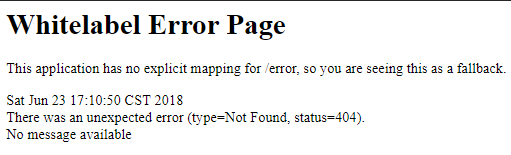
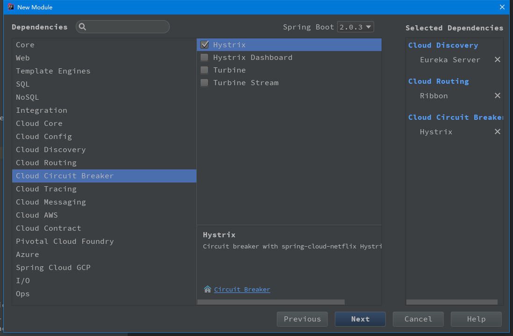

# 服务容错保护 一一 断路由

在启动该服务之前同 [服务发现与消费](../springcloud-ribbon-consumer) 一样先启动单节点服务注册中心
与两个不同端口的服务提供者，具体看 **服务发现与消费** 模块说明文件。

接着讲 **服务发现与消费**  拷贝一份并启动服务。在注册中心面板中看到消费者服务后将之前启动的两个不同端口的服务提供者断开一个，访问 `http://localhost:9999/ribbon-consumer` 连续访问，在客户端负载均衡轮询到断开的那个服务时页面就会报错：



---

现在引入 `Spring Cloud Hystrix` 服务容错保护 一一 断路由 对工程进行改造

- 直接引入 `spring-cloud-starter-netflix-hystrix` 依赖：

```xml
<dependency>
			<groupId>org.springframework.cloud</groupId>
			<artifactId>spring-cloud-starter-netflix-hystrix</artifactId>
</dependency>
```

- 或则同 服务发现与消费 一样在新建工程时勾选 hystrix 即可：



----

- 改造启动类

在启动类上加上 `@EnableCircuitBreaker` 注解开启断路由功能

```java

@EnableCircuitBreaker
@EnableDiscoveryClient
@SpringBootApplication
public class SpringcloudRibbonHystrixConsumerApplication {

	@Bean
	@LoadBalanced
	RestTemplate restTemplate() {
		return new RestTemplate();
	}

	public static void main(String[] args) {
		SpringApplication.run(SpringcloudRibbonHystrixConsumerApplication.class, args);
	}
}

```

- 改造消费者发布方式

新增 `HelloService` 类，注入 `RestTemplate` 实例。然后将在 `ConsumerController` 中对 RestTemplate 的使用迁移到 `ribbonConsumer` 方法中，最后在该方法上增加 `@HystrixCommand(fallbackMethod = "")` 注解来指定回调方法

```java

@Service
public class HelloService {

	@Resource
	private RestTemplate restTemplate;

	@HystrixCommand(fallbackMethod = "helloFallBack")
	public String ribbonConsumer() {
		return restTemplate.getForEntity("http://hello-service/index", String.class).getBody();
	}

	public String helloFallBack() {
		return "error";
	}
}

```

- 修改 `ConsumerController` 类

注入上面实现的 `HelloService ` 实例，并在 `ribbonConsumer` 方法中进行调用

```java

@RestController
@RequestMapping
public class ConsumerController {

	@Resource
	private HelloService helloService;

	@GetMapping("ribbon-consumer")
	public String ribbonConsumer() {
		return helloService.ribbonConsumer();
	}
}

```

现在再进行启动消费者服务，再将之前的启动的两个服务提供者断开一个，在进行轮训访问 `http://localhost:9999/ribbon-consumer` 会发现当轮询到断开的那个服务时页面不会出现报错信息，而是打印了 `error`，这就是之前 `helloFallBack` 方法中的返回值。说明 **Hystrix** 生效了。

----

另外，我们还可以模拟一下服务阻塞（长时间未响应）的情况。

我们在 [服务提供者的HelloWorldController](../springcloud-eureka-service/src/main/java/com/mingrn/service/web) 进行改造。新增一个方法 `serviceBlock`

```java

  @GetMapping("/serviceBlock")
	public String serviceBlock() throws InterruptedException {
		ServiceInstance serviceInstance = serviceInstance();

		//让线程等待几秒
		int sleepTime = new Random().nextInt(3000);
		LOGGER.info(">>> sleepTime: " + sleepTime);
		Thread.sleep(sleepTime);

		LOGGER.info("provider service, host：{}，service_id：{}", serviceInstance.getHost(), serviceInstance.getServiceId());
		return "provider service, host：" + serviceInstance.getHost() + "，service_id：" + serviceInstance.getServiceId();
	}

```

通过 Thread.sleep() 函数可让 serviceBlock 接口的处理线程不是马上返回内容，而是在阻塞一段时间后才返回内容。由于 **Hystrix** 默认超时时间为 2000 毫秒，所以这里采用了 0 至 3000 毫秒的随机数放处理过程有一定概率发生超时来触发断路由。为了更精确的观察断路由的触发，在消费者函数中做一些时间记录，新增一个方法

```java

	@HystrixCommand(fallbackMethod = "helloFallBack")
	public String serviceBlock() {
		long start = System.currentTimeMillis();
		ResponseEntity<String> responseEntity = restTemplate.getForEntity("http://hello-service/serviceBlock", String.class);
		long end = System.currentTimeMillis();
		LOGGER.info("Speed time : " + (end - start));
		return responseEntity.getBody();

	}

```

在消费在Controller 中增加一个方法

```java

@GetMapping("serviceBlock")
	public String serviceBlock() {
		return helloService.serviceBlock();
	}

```

重新启动消费者服务进行访问 `http://localhost:9999/serviceBlock` 接着断开其中一个服务提供者再次访问会得到与之前一样的结果，并在控制台打印了本次访问时长。
