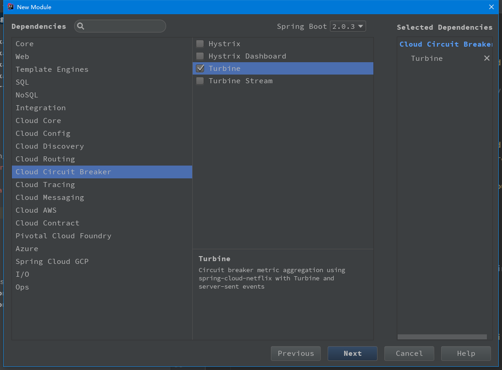
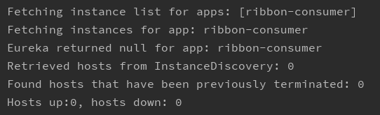

# springcloud-turbine 集群监控

构建该工程与之前一样，只需要勾选 Turbine 即可，如图：



或者直接引入 `turbine` 依赖

```xml
<dependency>
    <groupId>org.springframework.cloud</groupId>
    <artifactId>spring-cloud-starter-netflix-turbine</artifactId>
</dependency>
```

这样，工程就创建完成，但是还需要引入 `actuator` 依赖：

```xml
<dependency>
    <groupId>org.springframework.boot</groupId>
    <artifactId>spring-boot-starter-actuator</artifactId>
</dependency>
```

准备工作完成后，需要在启动类上加 `@EnableTurbine` 注解和 `@EnableDiscoveryClient` 注解。

- `@EnableTurbine`：开启 Turbine

配置文件如下：

```profile
spring.application.name=turbine

server.port=8989
#management.server.port=8990

eureka.instance.hostname=localhost

eureka.client.service-url.defaultZone=http://${eureka.instance.hostname}:8888/eureka

turbine.app-config=ribbon-consumer
turbine.cluster-name-expression="default"
turbine.combine-host-port=true
```

- `turbine.app-config`：指定需要收集的监控信息的服务名。
- `turbine.cluster-name-expression`：指定集群的名称，当服务数量非常多的时候，可以启动多个 Turbine 服务来构建不同的聚合集群，而该参数可以用来区分这些不同的聚合集群，同时该参数值可以在 Hystrix 仪表盘中用来定位不同的集群，只需要在 Hystrix Stream 的URL 中通过 cluster 参数指定。
- `turbine.combine-host-port`：可以让统一主机上的服务通过主机名与端口号的祝贺进行区分，默认情况下会以host来区域不同的服务，这会使在本地调试时，本机上的不同服务聚合成一个服务来统计。

启动服务，在控制台中能看到如下日志信息即表示成功：



访问：`http://localhost:8989/actuator` 能看到如下信息：

```json
{
	_links: {
		self: {
			href: "http://localhost:8989/actuator",
			templated: false
		},
		health: {
			href: "http://localhost:8989/actuator/health",
			templated: false
		},
		info: {
			href: "http://localhost:8989/actuator/info",
			templated: false
		}
	}
}
```
