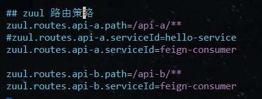
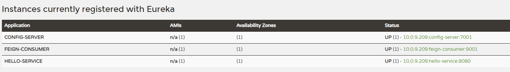
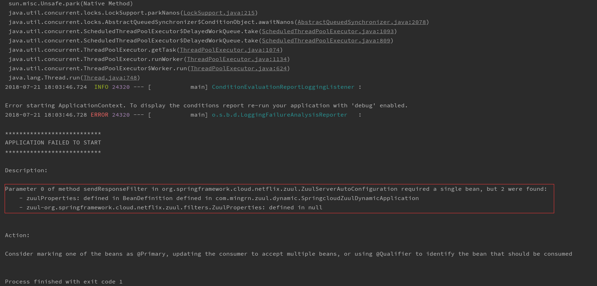

# springcloud-zuul-dynamic Api 网关动态更新路由

**注意：** 在宠幸本工程之前请先保证对 SpringCloud Config 有一定的了解，或者看完如下几个工程之后再来尝试宠幸本工程。

+ Config 分布式配置中心服务端与客户端
  - [springcloud-config-server](../springcloud-config-server)
  - [springcloud-config-client](../springcloud-config-client)
  
+ Config 分布式配置中心服务端与客户端高可用
  - [springcloud-config-server-eureka](../springcloud-config-server-eureka)
  - [springcloud-config-client-eureka](../springcloud-config-client-eureka)
  
---

在 [springcloud-zuul](../springcloud-zuul) 工程中，主要介绍了路由的四个声明周期、路由策略及异常处理等功能。其中，在路由策略中主要是在配置文件中采用路由规则与服务一一对应的方式。如下：

- `zuul.routes.<route>.path=/api-a/**`
- `zuul.routes.<route>.serviceId=hello-service`

当然，还有另一种更简洁的方式。上面的可以直接简写成 `zuul.routes.hello-service=/api-a/**`，没有采用这种方式主要原因是笔者觉得不够直观！当然，不然采用哪种方式都能达到路由效果。不过，
当各位童鞋看到这种配置方式有没有产生过一种疑问？就是我们直接在配置文件中定义路由策略那如果后续增加新功能是如果要增加路由规则怎么办呢？现将服务 Cut Down？这种策略肯定是不可行的！不过，当我们
对 SpringCloud Config 有一定的了解后就会找到解决方案 一一 动态更新！这是 Config 一个强大的功能，既然 SpringCloud Config 已经提供了这么强大的功能我们何不来尝试一下呢？啥也别说了，直接开撸吧！

---

创建工程引入如下几个依赖：

```xml
<dependency>
    <groupId>org.springframework.boot</groupId>
    <artifactId>spring-boot-starter-web</artifactId>
</dependency>
<dependency>
    <groupId>org.springframework.cloud</groupId>
    <artifactId>spring-cloud-starter-config</artifactId>
</dependency>
<dependency>
    <groupId>org.springframework.cloud</groupId>
    <artifactId>spring-cloud-starter-netflix-eureka-client</artifactId>
</dependency>
<dependency>
    <groupId>org.springframework.cloud</groupId>
    <artifactId>spring-cloud-starter-netflix-eureka-server</artifactId>
</dependency>
<dependency>
    <groupId>org.springframework.cloud</groupId>
    <artifactId>spring-cloud-starter-netflix-zuul</artifactId>
</dependency>
<dependency>
    <groupId>org.springframework.boot</groupId>
    <artifactId>spring-boot-starter-actuator</artifactId>
</dependency>
```

引入这些依赖原因这里就不对说了，在 SpringCloud Config 四个工程中都有说明！不过，这里还是要说一下 `spring-boot-starter-web` 依赖。在使用 Idea 创建 Cloud 工程时，通常都不会勾选这个依赖，如果不
引入该依赖在启动应用程序是会出异常，原因你懂的(之前有说过)！

在配置文件 `bootstrap.properties` 增加属性如下：

```properties
server.port=5556
eureka.instance.hostname=localhost
spring.application.name=api-gateway
spring.cloud.config.discovery.enabled=true
spring.cloud.config.discovery.service-id=config-server
eureka.client.service-url.defaultZone=http://${eureka.instance.hostname}:8888/eureka
management.endpoints.web.exposure.include=*

spring.cloud.config.label=master
#spring.cloud.config.profile=dev
```

- `spring.cloud.config.discovery.enabled`：开启服务访问ConfigServer功能
- `spring.cloud.config.discovery.service-id`：指定ConfigServer注册中心服务名
- `eureka.client.service-url.defaultZone`：指定服务注册中心地址
- `management.endpoints.web.exposure.include`：暴露所有监控端点，这里主要利用 `/refresh` POST端点起到刷新作用

> 为什么是 `bootstrap.properties` 而不是 `application.properties` 在 Config 四个工程中也有说明！

在远程仓库配置中心增加 `api-gateway.properties` 配置文件，文件内容如下:



在远程配置文件中主要增加了两个路由策略。

>**注意：** Api 网关服务在 Git 仓库中配置文件名称完全取决于网关应用配置文件 bootstrap.properties 中的 `spring.application.name` 属性值。

修改启动类，增加如下注解：

- `@EnableZuulProxy` 开启路由功能
- `@EnableDiscoveryClient` 用于服务注册发现

如下所示：

```java
@EnableZuulProxy
@EnableDiscoveryClient
@SpringCloudApplication
public class SpringcloudZuulDynamicApplication {

	@Bean
	@RefreshScope
	public ZuulProperties zuulProperties() {
		return new ZuulProperties();
	}

	public static void main(String[] args) {
		new SpringApplicationBuilder(SpringcloudZuulDynamicApplication.class).web(WebApplicationType.SERVLET).run(args);
	}
}
```

另外，在启动类中注册了一个 Bean，这个 Bean 的作用是将远程配置中心的内容注入本服务，并生成一个配置文件(这里只是比喻)！一切准备就绪，启动服务启动如下几个服务：

- `springcloud-eureka`：服务注册中心
- `springcloud-config-server-eureka`：ConfigServer 服务
- `springcloud-eureka-service`：hello-service 服务
- `springcloud-feign-consumer`：feign-consumer 服务

当这几个服务启动完成后，并在服务注册中心面板中看到所有服务实例后再启动本服务！



在启动本服务时，发现并没有成功启动。是不是有点惊喜？看下主要的错误日志



主要看红框标注的日志信息。还记得 `bootstrap.properties` 与 `application.properties` 配置文件的区别吗？`bootstrap` 的加载优先级比较高，优先于 `application.properties` 与 `.jar` 文件。

而远程仓库加载的配置文件就相当于是一个 `bootstrap.properties` 配置文件。另外，我们在本应用程序中同样有一份 `bootstrap.properties` 文件。那我们以哪个文件为主呢？所以，我们需要在这里指出来。这里由于远程Git 仓库的配置文件只是路由配置，为了防止该配置被本地
文件覆盖，所以在注册 Bean 是这里使用 `@Primary` 注解表示它为主配置文件。

```java
@Bean
@Primary
@RefreshScope
public ZuulProperties zuulProperties() {
    return new ZuulProperties();
}
```

另外，如果在远程配置文件中的配置过多，而有些是我们仅仅需要以 `zuul` 开头的配置，拿着这里还可以增加 `@ConfigurationProperties(prefix = "zuul")` 来加载指定配置属性。

现在重启服务，就能正常启动。现在我们访问：`http://localhost:5556/api-b/feign-consumer2` 与 `http://localhost:5556/api-a/index` 两个地址。可以看到能成功访问并且返回的信息也与在之前的工程中返回的信息相同,如下：

```log
#http://localhost:5556/api-b/feign-consumer2
provider service, host：localhost，service_id：HELLO-SERVICE HelloMinGRn name=MinGRn,age=18 HelloMinGRn,18
#http://localhost:5556/api-a/index
provider service, host：localhost，service_id：HELLO-SERVICE
```

说明成功路由！

现在再来测试一下动态路由，我们将之前远程配置文件内容修改如下，并推送至远程

```properties
zuul.routes.api-a.path=/api-a/**
#zuul.routes.api-a.serviceId=hello-service
zuul.routes.api-a.serviceId=feign-consumer

zuul.routes.api-b.path=/api-b/**
zuul.routes.api-b.serviceId=feign-consumer
```

这里将之前的 `api` 路由服务同样设置成 `feign-consumer` 服务。现在我们来通过 POSTMan 或者 curl 工具发送 post 请求访问 `http://localhost:5556/actuator/refresh` 以实现动态刷新。在控制台中看到日志信息后即表示成功，现在我们来访问
`http://localhost:5556/api-b/feign-consumer2` 与 `http://localhost:5556/api-a/feign-consumer2` 两个地址，返回的信息全是如下信息：

```
provider service, host：localhost，service_id：HELLO-SERVICE HelloMinGRn name=MinGRn,age=18 HelloMinGRn,18
```

说明动态路由成功实现！