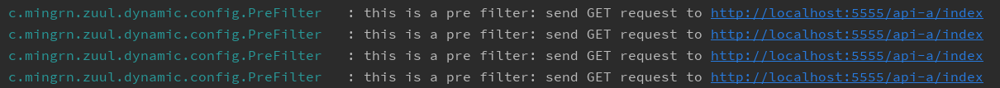
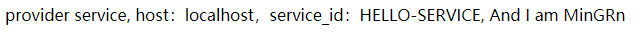
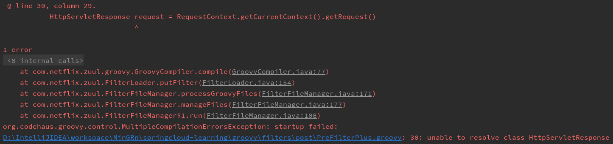

# 基于 Groovy 的动态过滤器

在 [springcloud-zuul-api-gateway-dynamic](../springcloud-zuul-api-gateway-dynamic) 工程中详细介绍了基于远程 Git 仓库的动态路由配置。能实现动态路由完完全是得力于 SpringCloud Config的动态加载。

既然通过 Zuul 构建的 API 网关服务能够轻松实现动态路由的加载，那么对于 API 网关服务的另一个重大功能 一一 请求过滤的动态加载怎么能轻易放过呢？只是，与动态路由不同的是动态路由是基于配置文件的，我们能够基于 Config
 来达到动态加载的目的，但是对于过滤器是无法做到的。想实现动态过滤器我们需要借助 Groovy 语言。
 
> **维基百科**
Groovy是Java平台上设计的面向对象编程语言。这门动态语言拥有类似Python、Ruby和Smalltalk中的一些特性，可以作为Java平台的脚本语言使用，Groovy代码动态地编译成运行于Java虚拟机（JVM）上的Java字节码，并与其他Java代码和库进行互操作。由于其运行在JVM上的特性，Groovy可以使用其他Java语言编写的库。

下面就来看下如何基于 Groovy 实现动态过滤器的加载。

创建工程，并引入如下依赖

```xml
<dependency>
    <groupId>org.springframework.boot</groupId>
    <artifactId>spring-boot-starter-web</artifactId>
</dependency>
<dependency>
	<groupId>org.springframework.cloud</groupId>
	<artifactId>spring-cloud-starter-netflix-eureka-client</artifactId>
</dependency>
<dependency>
	<groupId>org.springframework.cloud</groupId>
	<artifactId>spring-cloud-starter-netflix-eureka-server</artifactId>
</dependency>
<dependency>
	<groupId>org.springframework.cloud</groupId>
	<artifactId>spring-cloud-starter-netflix-zuul</artifactId>
</dependency>

<dependency>
	<groupId>org.codehaus.groovy</groupId>
	<artifactId>groovy-all</artifactId>
</dependency>
```

>**注意：** `groovy-all` 依赖不要引错！

在启动类上加入 `@EnableZuulProxy` 注解开启路由功能：

```java
@EnableZuulProxy
@SpringCloudApplication
public class SpringcloudZuulFilterDynamicApplication {

	public static void main(String[] args) {
		new SpringApplicationBuilder(SpringcloudZuulFilterDynamicApplication.class).web(WebApplicationType.SERVLET).run(args);
	}
}
```

下面修改配置文件如下：

```properties
server.port=5555
spring.application.name=api-gateway
eureka.instance.hostname=localhost
eureka.client.service-url.defaultZone=http://${eureka.instance.hostname}:8888/eureka
zuul.routes.api-a.path=/api-a/**
zuul.routes.api-a.serviceId=hello-service
zuul.filter.root=groovy/filters
zuul.filter.refreshInterval=5
```

这里笔者自定义了两个属性：

> - `zuul.filter.root`：动态过滤器文件目录
> - `zuul.filter.refreshInterval`：过滤器动态加载时间间隔,单位秒

增加配置类 `GroovyFilterConfig`：

```java
@Configuration
public class GroovyFilterConfig {

	private static Logger LOGGER = LoggerFactory.getLogger(GroovyFilterConfig.class);

	@Value("${zuul.filter.root}")
	private String scriptRoot;

	@Value("${zuul.filter.refreshInterval}")
	private Integer refreshInterval;


	@Bean
	public FilterLoader filterLoader() {
		FilterLoader filterLoader = FilterLoader.getInstance();
		filterLoader.setCompiler(new GroovyCompiler());
		FilterFileManager.setFilenameFilter(new GroovyFileFilter());
		try {
			FilterFileManager.init(
					refreshInterval,
					scriptRoot + "/pre", scriptRoot + "/post"
			);
		} catch (Exception e) {
			LOGGER.error("FilterFileManager Init Exception ==>", e);
		}
		return filterLoader;
	}
}
```

这里主要注意的是 `FilterFileManager.init()`，先看下这个方法的源码

```java
/**
* Initialized the GroovyFileManager.
*
* @param pollingIntervalSeconds the polling interval in Seconds
* @param directories  Any number of paths to directories to be polled may be specified
* @throws IOException
* @throws IllegalAccessException
* @throws InstantiationException
*/
public static void init(int pollingIntervalSeconds, String... directories) throws Exception, IllegalAccessException, InstantiationException {
    if (INSTANCE == null) INSTANCE = new FilterFileManager();

    INSTANCE.aDirectories = directories;
    INSTANCE.pollingIntervalSeconds = pollingIntervalSeconds;
    INSTANCE.manageFiles();
    INSTANCE.startPoller();
}
```

其中参数：

- `pollingIntervalSeconds`：轮询时间间隔，单位是秒
- `directories`：文件目录，任意多个

而笔者在配置文件中增加的 `zuul.filter.refreshInterval` 就是轮询时间间隔，`zuul.filter.root` 是过滤器文件基础路径。这里笔者增加了两个路径，分别是 `pre` 类型和 `post` 类型过滤器文件夹，这里随意定义！

另外，笔者这里定义的是相对路径文件夹。当项目运行时，会自动填充绝对路径，绝对路径地址就是项目跟目录，等同与 `System.getProperty("user.dir")`。

现在，一切准备工作完成后，就来启动服务注册中心 [springcloud-eureka](../springcloud-eureka) 与 Hello-server 服务[springcloud-eureka-service](../springcloud-eureka-service)，等着两个服务成功启动后就来启动本服务。

访问URL `http://localhost:5555/api-a/index` 会返回如下信息：

```log
provider service, host：localhost，service_id：HELLO-SERVICE
```

并且控制台除了请求路由信息外没有任何信息，现在我们就来动态增加 `pre` 类型路由，在 [groovy/filters/pre](../groovy/filters/pre) 目录下创建基于 Groovy 语言的类 `PreFilter.groovy`：

```groovy
import com.netflix.zuul.ZuulFilter
import com.netflix.zuul.context.RequestContext
import com.netflix.zuul.exception.ZuulException
import org.slf4j.Logger
import org.slf4j.LoggerFactory

import javax.servlet.http.HttpServletRequest

class PreFilter extends ZuulFilter {

    private static Logger LOGGER = LoggerFactory.getLogger(PreFilter.class);

    @Override
    String filterType() {
        return "pre"
    }

    @Override
    int filterOrder() {
        return 1000
    }

    @Override
    boolean shouldFilter() {
        return true
    }

    @Override
    Object run() throws ZuulException {
        HttpServletRequest request = RequestContext.getCurrentContext().getRequest()
        LOGGER.info("this is a pre filter: send {} request to {}", request.getMethod(), request.getRequestURL().toString())
        return null
    }
}
```

不需要重启服务，等待五秒后再次刷新请求会看到控制台成功打印如下日志：



说明过滤器动态织入成功！

现在再来在 [groovy/filters/post](../groovy/filters/post) 文件夹下增加基于 `post` 过滤的器 `PostFilter.groovy`：

```groovy
import com.netflix.zuul.ZuulFilter
import com.netflix.zuul.context.RequestContext
import com.netflix.zuul.exception.ZuulException
import org.slf4j.Logger
import org.slf4j.LoggerFactory

import javax.servlet.http.HttpServletResponse

class PostFilter extends ZuulFilter {

    private static Logger LOGGER = LoggerFactory.getLogger(PostFilter.class);

    @Override
    String filterType() {
        return "post"
    }

    @Override
    int filterOrder() {
        return 2000
    }

    @Override
    boolean shouldFilter() {
        return true
    }

    @Override
    Object run() throws ZuulException {
        LOGGER.info("this is a post filter: Receive response")
        HttpServletResponse response = RequestContext.getCurrentContext().getResponse()
        response.getOutputStream().print(", And I am MinGRn")
        response.flushBuffer()
    }
}

```

等待五秒钟，刷新请求，会看到页面返回如下信息：



说明动态 POST 类型过滤器成功织入！

在增加动态过滤器时，需要注意一点！在编写 Groovy 时语法不要错误，比如笔者这里，利用vim直接在 post 文件夹写的，就出现了语法错误



因为笔者没撸过 Groovy，后来在利用 Idea 写时发现貌似不需要 `;`。虽然 Groovy 与 Java 有许多相似之处，不过还是有点差别的，需要注意一下！最好利用 IDE 工具，不要直接在 vim 中编写！