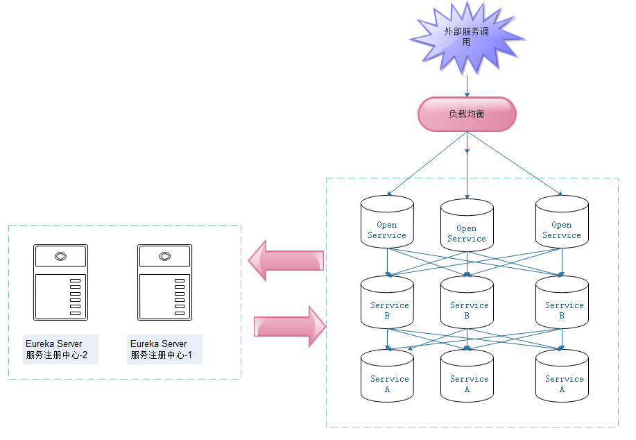
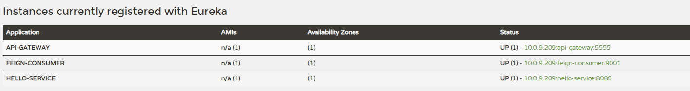
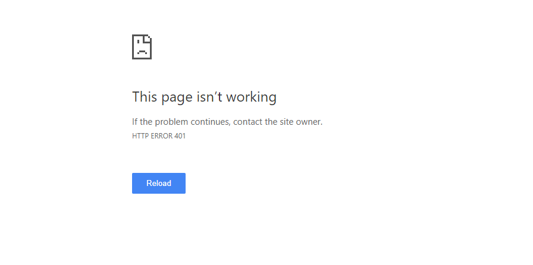
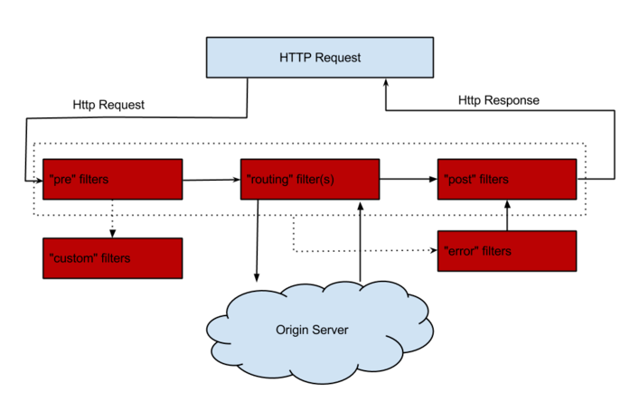
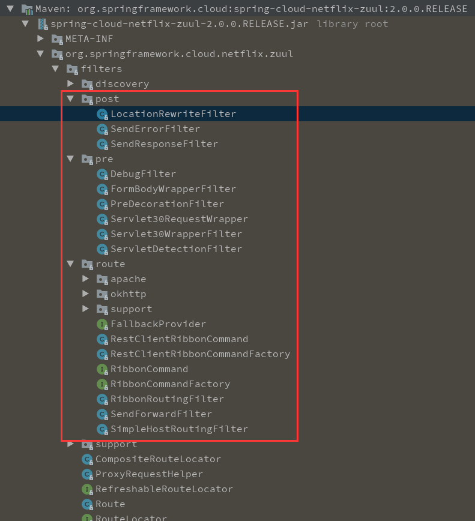

# API 网关服务 Spring Cloud Zuul

在之前的模块实例中我们对 Spring Cloud Netflix 下的核心组件已经了解一大半。这些组件基本涵盖了微服务建构中最基本的几个核心设施，利用这些组件我们已经可以构建起一个简单的微服务架构系统。

如：通过使用 Spring Cloud Eureka 实现高可用的服务注册中心以及实现微服务的注册于发现；通过 Spring Cloud Ribbon 或 Feign 实现服务间负载均衡的接口调用；对于依赖的服务调用使用 Spring Cloud Hystrix 来进行包装，实现线程隔离并加入熔断机制，以避免在服务架构中因个别服务出现异常而引起级联故障蔓延。通过上诉思路，可以设计出类似下图的基础系统机构。



在该架构中，我们的服务集群包含内部服务 Service A 和 Service B，他们都会向 Eureka Service 集群进行注册与订阅服务，而 Open Service 是一个对外的 RESTFul Api 服务，它通过 F5、Nginx 等网络设备或工具软件实现对各个微服务的路由与负载均衡，并公开给外部的客户端调用。

首先可以肯定的是，这个架构是没有问题的。但是我们可以通过开发与运维的角度思考是否还有些不足。

**运维：**

当客户端应用单机某个功能的时候往往会发出一些对微服务获取资源的请求到后端，这些请求通过 F5，Nginx 等设施的路由和负载均衡分配后被转发到各个不同的服务实例上。为这些实例可能都会在不同的 IP 主机上，运维人员需要手动维护这些路由规则与服务实例列表，当有实例增减或 IP 地址变动时，也需要手动去同步修改这些信息。当系统规模不大的时候运维很容易去维护，但是，当系统庞大后，看似简单的实际上会让运维痛苦不堪。

**开发：**

现在，我们在来看下开发人员的角度。在大多数情况下，为了保证对外服务的安全性，我们在服务端的微服务接口中往往都会增加权限校验机制，比如校验登录状态等；同时为了防止客户端在发起请求时被串改等安全方面的考虑，还会有一些签名校验的机制存在。在这个时候，由于使用微服务架构的理念，我们不得不在各个微服务中增加这样的一套逻辑。随着规模不断扩大，这些校验逻辑变得越来越冗余，突然有一天，我们发现这样的逻辑存在问题或BUG在修复时有需要在每一个我服务应用中做修改，又会引起开发人员的抱怨与测试人员的负担。

为了解决这样的问题 **API 网关** 的概念应运而生。既然 API 网关这么重要那再微服务中是否也有这样的解决方案呢 一一 Spring Cloud Zuul。

----

## 构建网关

构建一个Spring Boot 应用，引入 `spring-cloud-starter-netflix-zuul` 包。

```xml
<dependency>
	<groupId>org.springframework.cloud</groupId>
	<artifactId>spring-cloud-starter-netflix-zuul</artifactId>
</dependency>
```

在启动类上加上 `@EnableZuulProxy` 注解开启 Zuul Api 网关服务功能。

```java
@EnableZuulProxy
@SpringCloudApplication
public class SpringcloudZuulApplication {

	public static void main(String[] args) {
		new SpringApplicationBuilder(SpringcloudZuulApplication.class).web(true).run(args);
	}
}
```

> **注意：** 这里使用的是 `@SpringCloudApplication` 注解，如果使用的是 `@SpringBootApplication` 注解还需要加上 `@EnableDiscoveryClient` 注解。另外一点这里并不是直接采用
```
public static void main(String[] args) {
	SpringApplication.run(SpringcloudZuulApplication.class, args);
}
```
>因为使用 `SpringApplicationBuilder`，可以在应用程序启动之前更改其中一些应用程序默认设置，即使这些设置中的大多数都具有合理的默认值。因此，只需几行代码，您就可以为不同目的（嵌入式部署，外部部署，测试等）构建具有不同设置的不同应用程序，同时您的实际底层业务逻辑保持不变。

在配置文件中配置 Zuul 应用的基础信息，如应用名、服务端口等信息：

```
spring.application.name=api-gateway
server.port=5555
```

**请求路由**

为了与 Eureka 整合，我们需要在 pom 文件中引入 eureka 依赖：

```xml
<dependency>
	<groupId>org.springframework.cloud</groupId>
	<artifactId>spring-cloud-starter-netflix-eureka-server</artifactId>
</dependency>
```

另外，我们需要在配置文件中指定服务注册中心与具体的路由规则，具体如下：

```
## eureka
eureka.instance.hostname=localhost
eureka.client.service-url.defaultZone=http://${eureka.instance.hostname}:8888/eureka

## zuul 路由策略
zuul.routes.api-a.path=/api-a/**
zuul.routes.api-a.serviceId=hello-service

zuul.routes.api-b.path=/api-b/**
zuul.routes.api-b.serviceId=feign-consumer
```

- `zuul.routes.api-a.path`：路由规则，所有请求路径中包含 `/api-a/` 都访问 `zuul.routes.api-a.serviceId` 指定的服务。
- `zuul.routes.api-a.serviceId`：指定服务，每个服务都会有一个名称即在配置文件中通过 `spring.application.name` 指定的服务名称。

其中 `api-a` 与 `api-b` 都是自己定义的，比如如果要请求的服务是 hello-service 为了可读性可以写成：

```
zuul.routes.hello-service.path=/api-a/**
zuul.routes.hello-service.serviceId=hello-service
```

但是，每一对路由 path 与 serviceId 一定要对应。

启动服务注册中心（[springcloud-eureka](../springcloud-eureka)）、服务提供者（[springcloud-eureka-service](../springcloud-eureka-service)） 与 服务消费者（[springcloud-feign-consumer](../springcloud-feign-consumer) 和该应用。

>**注意：** 这里的服务提供者与服务消费者不要搞混，因为都是注册到服务注册中心所以这两个应用都是服务提供者与服务消费者，因为 springcloud-feign-consumer 功能调用的 springcloud-eureka-service ，所以对于 springcloud-eureka-service 来说 springcloud-feign-consumer 就是它的消费者。

如下界面：



在 hello-service 这个服务中，有 `/index` 这个接口。而我们在配置路由规则的时候是 `/api-a/**`，所以当我们访问 `127.0.0.1:5555/api-a/index` 的时候就会被 zuul 路由转发访问 `127.0.0.1:8080/index` 这个接口。为了确定是否这样我们先访问一下 `127.0.0.1:8080/index` 。会看到页面打印如下信息：

```
provider service, host：localhost，service_id：HELLO-SERVICE
```

现在再来通过网关路由访问：`127.0.0.1:5555/api-a/index` 会看到打印同样的信息，说明路由成功。

在 feign-consumer 这个服务中有个接口 `/feign-consumer2` 我们通过路由访问： `127.0.0.1:5555/api-b/feign-consumer2` 会看到打印如下信息：

```
provider service, host：localhost，service_id：HELLO-SERVICE HelloMinGRn name=MinGRn,age=18 HelloMinGRn,18
```

说明路由同样成功。

这就做到了**通过访问一个主机通过不同的路由规则而做到访问不同的主机。**

现在，解决了运维人员的问题。

不过，实现了请求路由功能之后，我们的微服务应用其功能的接口就通过统一的 API 网关入口被客户端访问到了，但是，每个客户端用户请求服务接口时往往都会做一定的限制，这就是开发人员的问题！

现在来看在路由中是如何做到这点的！我们只需要定义一个类 `AccessFilter` 用来继承 `ZuulFilter` 抽象类并实现它定义的四个抽象函数就能实现请求的拦截与过滤了。

```java
public class AccessFilter extends ZuulFilter {

	private static Logger LOGGER = LoggerFactory.getLogger(AccessFilter.class);

	@Override
	public String filterType() {
		return "pre";
	}

	@Override
	public int filterOrder() {
		return 0;
	}

	@Override
	public boolean shouldFilter() {
		return true;
	}

	@Override
	public Object run() throws ZuulException {
		RequestContext context = RequestContext.getCurrentContext();
		HttpServletRequest request = context.getRequest();

		LOGGER.info("send {} request to {}", request.getMethod(), request.getRequestURL().toString());

		Object token = request.getParameter("token");
		if (token == null) {
			LOGGER.warn("token is empty");
			context.setSendZuulResponse(false);
			context.setResponseStatusCode(401);
		}
		return null;
	}
}
```

> `AccessFilter` 需要注册成 Bean，比如使用 `@Component` 注解 或在配置类中注册中 Bean。

```java
//在配置类中注册成 Bean
@Bean
public AccessFilter accessFilter() {
	return new AccessFilter();
}
```

+ `filterType`：过滤器的类型，决定过滤器在请求的哪个周期中执行。
	- `pre`：请求被路由之前调用
	- `route`：请求被路由时调用
	- `post`：在 "route" 和 "error" 之后调用
	- `error`：处理请求时发生错误是调用
+ `filterOrder`：过滤器执行顺序,值越小优先级越高
+ `shouldFilter`：该过滤器是否被执行,可以通过此方法来指定过滤器的有效范围
+ `run`：具体的业务逻辑

这里我们在 `run()` 函数中增加了 request 请求中需要包含 `token` 参数信息。如果不包含则不对其进行路由并返回错误码 401。

现在来访问下 `127.0.0.1:5555/api-b/feign-consumer2` 会发现请求错误：



当我们在请求中增加 `token` 参数信息：`127.0.0.1:5555/api-b/feign-consumer2?token=1` 就能正常请求！

>**注意：** 在实际中不可能直接采用这种不安全的方式，这里只是测试使用。

关于 `shouldFilter()` 函数，我们可以直接看下 [官网Zuul](https://cloud.spring.io/spring-cloud-netflix/multi/multi__router_and_filter_zuul.html) 的一个 PRE 栗子：

```java
public class QueryParamPreFilter extends ZuulFilter {
	@Override
	public int filterOrder() {
		return PRE_DECORATION_FILTER_ORDER - 1; // run before PreDecoration
	}

	@Override
	public String filterType() {
		return PRE_TYPE;
	}

	@Override
	public boolean shouldFilter() {
		RequestContext ctx = RequestContext.getCurrentContext();
		return !ctx.containsKey(FORWARD_TO_KEY) // a filter has already forwarded
				&& !ctx.containsKey(SERVICE_ID_KEY); // a filter has already determined serviceId
	}
    @Override
    public Object run() {
        RequestContext ctx = RequestContext.getCurrentContext();
		HttpServletRequest request = ctx.getRequest();
		if (request.getParameter("sample") != null) {
		    // put the serviceId in `RequestContext`
    		ctx.put(SERVICE_ID_KEY, request.getParameter("foo"));
    	}
        return null;
    }
}
```

可以看到，在这个栗子中并不是直接在 `run()` 函数中做处理，只是在判断当 "sample" 参数部位 NULL 时，在  RequestContext 中增加 SERVICE_ID_KEY，在 `shouldFilter()` 函数中决定是否进行路由。

更多的路由讲解可以查看 [官网 Zuul](https://cloud.spring.io/spring-cloud-netflix/multi/multi__router_and_filter_zuul.html) 说明文档

## 路由异常处理与优化

前面说了，在 `Zuul` 中默认有四种过滤器，这四种过滤器涵盖了整个路由的生命周期。如图：



从图中可以看出，当玩不HTTP请求到达API网关时，首先会进入第一个阶段 `PRE` ，在这里他会被 `pre` 过滤器进行处理，在类型过滤器主要目的是在进行请求路由之前做一些前置加工，比如：**请求的检验**。在完成 `pre` 类型过滤器处理后，请求路由进入第二阶段 `ROUT`，也就是之前说的路由请求转发阶段，请求会被 `rout` 类型过滤器处理。这里具体处理内容就是将外部请求转发到具体服务实例上去的过程，当服务实例将请求返回后该阶段才算是完成。接着就会进入 `POST` 阶段，该阶段在处理的时候不仅可以获取请求信息还能获取到服务实例的返回信息。所以，在 `post` 类型过滤器中我们可以对处理结果进一步加工处理和转换工作。至于 `ERROR` 过滤器，这是一个特殊的过滤器阶段，因为在之前的三个过滤器中只要发生异常都会进入该阶段，该阶段主要是请求路由错误处理阶段。

在 Spring Cloud Zuul 中，在 HTTP 请求声明周期的各个阶段默认实现了一批核心过滤器，在 API 网关服务启动时会被自动加载和启动。可以看下 `org.springframework.cloud.netflix.zuul.filters` 包下三个不同声明周期的过滤器。



源码对应内容如下：

|请求周期	| 顺序|	过滤器	|功能	|
|:---------:|:-----:|:-----:|:-----:|
|pre	|	|	|	|
|	|-3	|ServletDetectionFilter| 标记处理 Servlet 类型|
|	|-2	|Servlet30WrapperFilter| 包装 HttpServletRequest 请求|
|	|-1	|FormBodyWrapperFilter|包装请求体|
|	|1	|DebugFilter| 标记调试标识|
|	|5|PreDecorationFilter|处理请求上下文供后续使用|
|rout|	|	|	|
| |10	|RibbonRoutingFilter	| serviceId 请求转发	|
| |100	|SimpleHostRoutingFilter	| URL 请求转发	|
| |500	|SendForwardFilter	|forward 请求转发	|
|post	|	|	|	|
||0	|SendErrorFilter	|处理有错误的请求相应	|
||1000	|SendResponseFilter	| 处理正常处理的请求相应	|

**关于异常处理**

笔者将之前定义的 `AccessFilter` 进行注释，并拷贝一份类型为 `TrowExceptionPreFilter` , 在 `run()` 函数处理时进行抛出异常，如下：

```java
@Component
public class TrowExceptionPreFilter extends ZuulFilter {

	private static Logger LOGGER = LoggerFactory.getLogger(TrowExceptionPreFilter.class);

	@Override
	public String filterType() {
		return "pre";
	}

	@Override
	public int filterOrder() {
		return 0;
	}

	@Override
	public boolean shouldFilter() {
		return true;
	}

	@Override
	public Object run() throws ZuulException {
		LOGGER.info("This is a pre filter, it will throw a RuntimeException");
		doSomething();
		return null;
	}

	private void doSomething() {
		throw new RuntimeException("Exist some errors...");
	}
}
```

> 直接在类上增加 `@Component` 让Spring能够创建该过滤器实例，或者像注册 `AccessFilter` 一样使用 `@Bean` 也是一样的。

现在重启服务，访问 `http://localhost:5555/api-b/feign-consumer2` 就会抛出如下异常，并且控制台也会有相应的异常日志输出。

```json
{
    "timestamp": "2018-07-15T03:00:04.594+0000",
    "status": 500,
    "error": "Internal Server Error",
    "message": "pre:TrowExceptionPreFilter"
}
```

> 这里使用的是 POSTMan 工具，在页面会出现相应的异常信息。

当然，我们也可以重新一个 `ErrorFilter` 错误路由异常处理类，如下：

```java
@Component
public class ErrorFilter extends ZuulFilter {

	private static Logger LOGGER = LoggerFactory.getLogger(ErrorFilter.class);

	@Override
	public String filterType() {
		return "error";
	}

	@Override
	public int filterOrder() {
		return 10;
	}

	@Override
	public boolean shouldFilter() {
		return true;
	}

	@Override
	public Object run() throws ZuulException {
		RequestContext context = RequestContext.getCurrentContext();
		Throwable throwable = context.getThrowable();
		LOGGER.error("this is a ErrorFilter{}", throwable.getCause().getMessage());
		return null;
	}
}
```

这样，当抛出异常时我们就可以统一在该类中进行处理。不过全部在该类中进行处理就没有缺陷？虽然在 `PRE` 、`POST`、 `ROUT` 三个阶段抛出异常后都会进入该类，但是也是有缺陷的，先来看下 `com.netflix.zuul.http` 包下的 `ZuulServlet` 类。其中有这段代码

```java
try {
    preRoute();
} catch (ZuulException e) {
    error(e);
    postRoute();
   return;
}
try {
    route();
} catch (ZuulException e) {
    error(e);
    postRoute();
    return;
}
try {
    postRoute();
} catch (ZuulException e) {
    error(e);
    return;
}
```

可以看到，在 `PRE` 、`ROUT` 阶段出现错误后进行 `ERROR` 处理后会再次进入 `POST` 阶段，唯有 `POST` 阶段在经过 `ERROR` 处理后就没有然后了。所以这就是之前说的不足的根源。而在三个阶段抛出异常后都会被 `SendErrorFilter` 类进行消费处理。那我们就可以根据这点进行处理。

现在，我们自定义一个 `ErrorExtFilter ` 类用于继承 `SendErrorFilter` 类，并重写出 `run()` 函数以外的方法，在 `shouldFilter()` 函数中，我们只处理有 `POST` 阶段抛出的异常。

```java
@Component
public class ErrorExtFilter extends SendErrorFilter {

	private static Logger LOGGER = LoggerFactory.getLogger(ErrorExtFilter.class);

	@Override
	public String filterType() {
		//error
		return super.filterType();
	}

	/**
	 * 该值要大于 `ErrorFilter` 类定义的值
	 */
	@Override
	public int filterOrder() {
		return 30;
	}

	@Override
	public boolean shouldFilter() {
		//TODO 判断：仅处理来自 POST 阶段引起的异常
		return true;
	}
}

```

那先在要怎么判断过滤器所处的阶段呢？现在来看下 `com.netflix.zuul` 包下的 `FilterProcessor` 类。其中有集合核心方法如下：

- `getInstance()` 获取当前处理器的实例
- `setProcessor(FilterProcessor processor)` 设置处理器实例，可以用此方法设置自定义的实例
- `processZuulFilter(ZuulFilter filter)` 定义了用来执行 filter 的具体逻辑，包括对请求上下文的设置，判断是否应该执行，执行时一些异常的处理等
- `getFiltersByType(String filterType)` 根据传入的 filterType 获取 API 网关中对应类型的过滤器，并根据这些过滤器的 filterOrder 从小到大排序，组织成一个列表返回
- `runFilters(String sType)` 根据传入的 filterType 来调用  `getFiltersByType(String filterType)` 获取排序后的过滤器列表，然后轮询这些过滤器，并调用 `processZuulFilter(ZuulFilter filter)` 来依次执行他们
- `preRoute()`调用 `runFilters("pre")` 来执行pre 类型的过滤器
- `route()` 调用 `runFilters("route")` 来执行 route 类型过滤器
- `postRoute()` 调用 `runFilters("post")` 来执行 post 类型过滤器
- `error()` 调用 ` runFilters("error")` 来执行 error 类型过滤器

现在就可以直接扩展 `processZuulFilter(ZuulFilter filter)`，通过过滤器执行时抛出异常时来进行捕获它，比如：

```xml
public class ExtFilterProcessor extends FilterProcessor {

	@Override
	public Object processZuulFilter(ZuulFilter filter) throws ZuulException {
		try {
			return super.processZuulFilter(filter);
		} catch (ZuulException ze) {
			RequestContext context = RequestContext.getCurrentContext();
			context.set("FAILED_FILTER", filter);
			throw ze;
		}
	}
}
```

创建一个 `ExtFilterProcessor` 类，继承 `FilterProcessor` 并重写 `processZuulFilter(ZuulFilter filter)` 方法，该方法内容很简单，唯一做的操作就是在外出增加了 `try catch` 语句块，当抛出异常
是向请求上下文中增加 `FAILED_FILTER` 属性，现在就可以继续完善之前定义的 `ErrorExtFilter` 类中 `shouldFilter()` 函数的操作：

```java
@Component
public class ErrorExtFilter extends SendErrorFilter {

	private static Logger LOGGER = LoggerFactory.getLogger(ErrorExtFilter.class);

	@Override
	public String filterType() {
		return super.filterType();
	}

	/**
	 * 该值要大于 `ErrorFilter` 类定义的值
	 */
	@Override
	public int filterOrder() {
		return 30;
	}

	@Override
	public boolean shouldFilter() {
		RequestContext context = RequestContext.getCurrentContext();
		ZuulFilter zuulFilter = (ZuulFilter) context.get("FAILED_FILTER");
		LOGGER.info("THE FILTER TYPE IS: {}", zuulFilter.filterType());

		return (zuulFilter != null && "post".equals(zuulFilter.filterType()));
	}
}
```

在函数中通过在上下文中设置的 `FAILED_FILTER` 参数获取 `ZuulFilter` 对象，判断该过滤器是否为 `POST` 阶段过滤器，当为 `POST` 阶段时返回 TRUE。到现在还需要一步操作，就是在启动类中加 `FilterProcessor.setProcessor(new ExtFilterProcessor());` 方法来启动自定义的核心处理器以完成我们优化的目标。
```java
@EnableZuulProxy
@SpringCloudApplication
public class SpringcloudZuulApplication {

	public static void main(String[] args) {
		FilterProcessor.setProcessor(new ExtFilterProcessor());
		new SpringApplicationBuilder(SpringcloudZuulApplication.class).web(true).run(args);
	}
}
```

现在重启服务 POST Filter测试抛出异常阶段，就会发现异常会抛出两遍。

----

# 关于自定义异常返回信息

在实现了对自定义过滤器中异常处理后，在实际应用中，返回的异常信息往往默认的异常信息输出不符合系统设计的相应格式，那我们就需要对信息进行定制。

最简单粗暴的方法就是编写一个自定义的 `post` 过滤器来组织错误结果，可以完全参考 `SendErrorFilter` 实现，然后直接组织请求相应结果而不是 forward 到 `/error ` 端点，只是需要注意的是，使用这种方法替代 `SendErrorFilter` 还需要禁用 `SendErrorFilter` 过滤器。

如果不使用上面的那种方法我们可以直接编织异常信息，`/error ` 端点的实现来至 `org.springframework.boot.autoconfigure.web.servlet.error` 包下的 `BasicErrorController` 类，如下：

```java
@Controller
@RequestMapping("${server.error.path:${error.path:/error}}")
public class BasicErrorController extends AbstractErrorController {

	@RequestMapping
	@ResponseBody
	public ResponseEntity<Map<String, Object>> error(HttpServletRequest request) {
		Map<String, Object> body = getErrorAttributes(request,
				isIncludeStackTrace(request, MediaType.ALL));
		HttpStatus status = getStatus(request);
		return new ResponseEntity<>(body, status);
	}
	// ...
}
```

通过调用 `getErrorAttributes` 方法来根据请求参数组织错误信息的返回结果，而该方法来至 `org.springframework.boot.web.servlet.error` 包下的 `DefaultErrorAttributes` 类，如下：

```java
@Order(Ordered.HIGHEST_PRECEDENCE)
public class DefaultErrorAttributes
		implements ErrorAttributes, HandlerExceptionResolver, Ordered {
		
	@Override
	public Map<String, Object> getErrorAttributes(WebRequest webRequest,
			boolean includeStackTrace) {
		Map<String, Object> errorAttributes = new LinkedHashMap<>();
		errorAttributes.put("timestamp", new Date());
		addStatus(errorAttributes, webRequest);
		addErrorDetails(errorAttributes, webRequest, includeStackTrace);
		addPath(errorAttributes, webRequest);
		return errorAttributes;
	}
	// ...
}
```

所以，如果需要编织错误信息只需要重写 `getErrorAttributes(WebRequest webRequest,boolean includeStackTrace)` 方法，在方法中进行处理即可，比如定义一个类 `ErrorAttributes` 继承 `DefaultErrorAttributes` 类，重写方法 `getErrorAttributes` ：

```java
@Component
public class ErrorAttributes extends DefaultErrorAttributes {

	@Override
	public Map<String, Object> getErrorAttributes(WebRequest webRequest, boolean includeStackTrace) {
		Map<String, Object> errorAttributes = super.getErrorAttributes(webRequest, includeStackTrace);
		return errorAttributes;
	}
}
```

这里只是进行了一次重新，如果需要操作比如删除一次信息 `message` ：`errorAttributes.remove("message");`

原输出异常信息如下：

```json
{
    "timestamp": "2018-07-15T06:41:29.992+0000",
    "status": 500,
    "error": "Internal Server Error",
    "message": "post:TrowExceptionPostFilter"
}
```

删除后异常信息如下：

```json
{
    "timestamp": "2018-07-15T06:51:39.565+0000",
    "status": 500,
    "error": "Internal Server Error"
}
```

## 禁用过滤器

不论是核心过滤器还是自定义的过滤器，只要 API 网关应用中为他们创建实例，默认情况下，他们都是启动状态的。那么如果有些过滤器我们不想使用了该如何禁止呢？直接在 `shouldFilter()` 函数中返回 false？这样改过滤器的请求将都不会被执行，基本实现了对过滤器的禁用。但这缺乏了灵活性。

实际上， Zuul 中特别提供了一个参数来禁用指定的过滤器，如下：

```
zuul.<SimpleClassName>.<fileType>.disable = true
```

其中， SimpleClassName 代表过滤器的类名，比如本工程开始创建的 `AccessFilter` 过滤器，`fileTyp>` 代表过滤器的类型，比如 `AccessFilter` 定义的过滤器类型为 `pre` ，如果需要禁用该过滤器只需要在配置文件中配置如下即可：

```
zuul.AccessFilter.pre.disable = true
```

该参数配置除了可以对自定义的过滤器禁用外，很多时候可以用来禁用 Spring Cloud Zuul 中默认定义的核心过滤器！

---

题外话(补充)：关于路由算法在 `extend` 包下有五个 DEMO，分别是：**轮询法**、**随机法**、**源地址哈希法**、**加权轮询法**、**加权随机法**。原文地址:[CSDN](https://blog.csdn.net/YEN_CSDN/article/details/55513549)